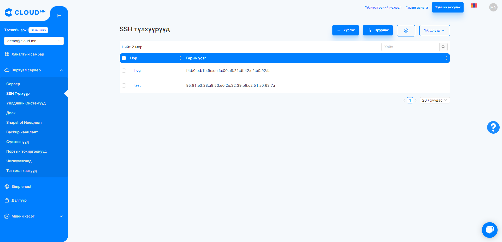
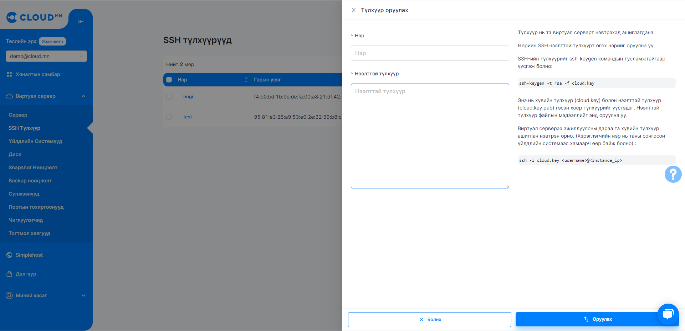

# Сервер (Instance)-тай холбогдох

## Консол ашиглан сервертэй холбогдох

<ol>
    <li>Сервер цэс рүү орно.</li>
    <li>Холбогдох гэсэн товч дээр дарна.</li>
    <li>Талбарт холбогдох тайлбар болон веб консолруу шууд холбогдох мэдээлэл гарч ирнэ.</li>
    <li>Веб консолтой холбогдох товч дээр дарснаар шинэ browser tab нээгдэж шууд сервер рүү хандах боломжтой болно</li>
</ol>

  

<hr></hr>

## Гаднаас сервертэй холбогдох

### Keypair үүсгэх

<ol>
    <li>Instance-г үүсгэх үед Keypair үүсгэх боломжтой байдаг. Мөн Keypair цэснээс Create Key Pair товчийг дарна.</li>
</ol>

  

<ol start='2'>
    <li>Үүсгэх гэж буй Keypair-н нэрийг бичээд Create товчийг дарснаар keypair үүсэх ба таны browser-д .pem файл татагдах болно.</li>
</ol>

  

<ol start='3'>
    <li>Өөрийн үүсгэсэн keypair-г ашиглах. Оруулах товчин дээр дарснаар нэр болон public key оруулах хэсэг гарч ирнэ.</li>
    <li>SSH-keygen хэрхэн generate хийх заавар мөн гарч ирнэ.</li>
</ol>

  

<hr></hr>

## Remote connection to Instance

### Keypair ашиглан Instance-д холбогдох

:::caution Анхааруулга
Remote буюу Web Console-с өөр газраас Instance-д хандахад Public IP хаяг зайлшгүй хэрэгтэй бөгөөд үүний тухай дараах бичиг баримтаас үзнэ үү <a href="./instance#ip-хаяг-удирдах-interface-manage">Instance-д Public IP хаяг нэмэх (Attach Interface)</a>, Instance-аа Private Network дотор үүсгэсэн бол <a href="./instance#серверт-floating-ip-хаяг-холбох-associate-floating-ip">Instance-д Floating IP хаяг нэмэх (Associate Floating IP)</a>. Хэрвээ тухайн Instance-н SSH port нээгээгүй байвал холбогдох боломжгүйг анхаарна уу! Security Group буюу виртуал firewall дээр SSH port нээх шаардлагатай байдаг ба дараахаас харна уу <a href="./security">SSH Port нээх, Instance дээр Security Group нэмэх</a>.
:::

<ol>
    <li>Instance үүсгэхдээ Authentication хэсэг Keypair хэмээх сонголтыг бөглөж, өөрийн үүсгэхэд Keypair-үүдээс сонгож тухайн Instance дээр уяж өгнө.</li>
    <li>Өөрийн РС дээр хадгалагдсан Keypair-н private key file (.pem file) байгаа directory дээр очиж command shell нээгээд дараах командыг бичнэ.</li>
</ol>

```bash
chmod 400 .\NAME.pem
ssh -i .\NAME.pem IMAGETYPE@IP
```

Жишээ нь таны Ubuntu үйлдлийн систем бүхий Instance 202.131.1.110 IP хаяг дээр ажиллаж байх тохиолдолд

:::caution Анхааруулга
Ubuntu системээс Instance-рүү холбогдох үед тухайн .pem файл зөвхөн read permission-тэй байхыг шаарддаг тул chmod 400 командыг ажиллуулах шаардлагатай.
:::

```bash
chmod 400 .\NAME.pem
ssh -i .\NAME.pem ubuntu@202.131.1.110
```

  

<hr></hr>

### Username password ашиглан нэвтрэх

:::tip Зөвлөгөө
Хэрвээ Username & Password ашиглаж нэвтрэхэд Web Console ба SSH гэх хоёр төрлөөр нэвтрэх боломжтой.
:::

#### Web Console-р нэвтрэх

<ol>
    <li>Instance үүсгэхдээ Authentication хэсэг Keypair хэмээх сонголтыг бөглөж, өөрийн үүсгэхэд Keypair-үүдээс сонгож тухайн Instance дээр уяж өгнө.</li>
    <li>Өөрийн РС дээр хадгалагдсан Keypair-н private key file (.pem file) байгаа directory дээр очиж command shell нээгээд дараах командыг бичнэ.</li>
</ol>

  

<ol start='3'>
    <li>Username & Password-г зөв оруулсны дараа Instance-руу холбогдоно.</li>
</ol>

  

#### SSH аргаар нэвтрэх
<ol>
    <li>Instance-г үүсгэхдээ Authentication талбарыг Password гэж сонгоод өөрийн ашиглах Username болон Password-оо оруулж өгөх.</li>
    <li>Instance руугаа SSH-р холбогдохдоо shell эсвэл terminal дээр ээ доорх командыг ажиллуулна.</li>
</ol>

```bash
ssh user_name@public_ip
```
<ol start='3'>
    <li>Тохируулсан password-г оруулна SSH-р амжилттай нэвтэрнэ.</li>
</ol>

<hr></hr>

### Windows Server үйлдлийн систем бүхий Instance-руу Remote Desktop Connection (RDP)-р холбогдох

:::caution Анхааруулга
Та RDP-р холбогдохын тулд тухайн Instance-н холбосон Security Group дээр RDP порт буюу 3389 port-г нээх шаардлагатай. Холбоотой баримт бичиг Security Groups, Security Group Role Managing
:::

<ol>
    <li>Та Windows Server-тэй Instance асаамагц юун түрүүнд заавал Web Console-р холбогдоно. Системийн хамгийн анхны хэрэглэгчийн Username болон Password-г тохируулж өгөх шаардлагатай.</li>
    <li>Windows server лүү холбогдох гэж буй client-с Remote Desktop Connection нээх.</li>
</ol>

  

<ol start='3'>
    <li>Computer талбарт Instance-н Public IP хаягыг оруулж өгөх.</li>
</ol>

  

<ol start='4'>
    <li>Connect хийхэд холбогдох хэрэглэгчийн credentials асуух бөгөөд эхний алхам дээр тохируулсан Username болон Password ашиглан нэвтэрнэ.</li>
</ol>

  

<ol start='5'>
    <li>Хэрвээ Credssp-тэй холбоотой алдаа гарах тохиолдолд. <a href="https://www.youtube.com/watch?v=Mp9vPS4Efto">How to Fix Credssp Encryption Oracle Remediation Error | Remote Desktop Connection</a> энэхүү заавар хэрэг болно.</li>
</ol>