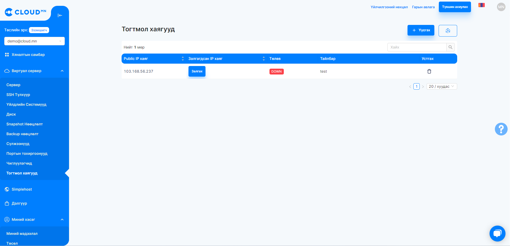
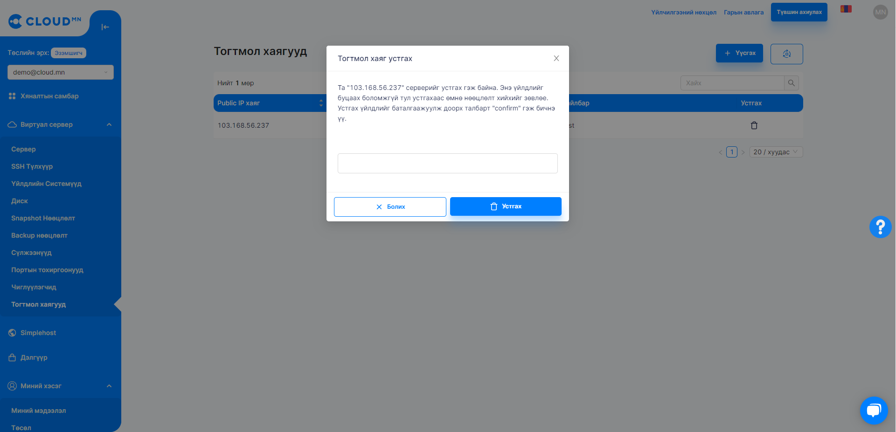
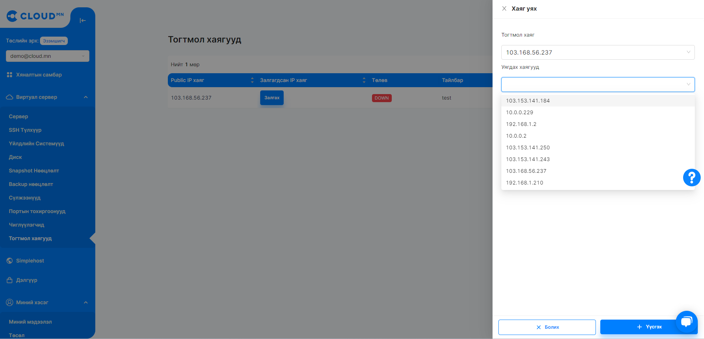

# Тогтмол хаяг (Floating IP)

## Тогтмол хаяг

Тогтмол хаяг нь Public IP хаяг нөөцлөх боломжийг олгоно. Private сүлжээний хаягтай үүссэн серверийг Public IP хаягтай болгохын тулд **Тогтмол хаяг**-ийг ашигладаг бөгөөд уг IP хаягийг салгаж өөр серверт холбох боломжтой байдаг.

  

### Тогтмол хаяг үүсгэх

<ol>
    <li><b>Виртуал сервер</b> цэсээс <b>Тогтмол хаягууд</b> цэсрүү орох.</li>
    <li><b>Үүсгэх</b> товч дээр дарснаар шинэ диалог цонх гарч ирнэ.</li>
    <li>Дэлгэрэнгүй хэсэгт тайлбарыг оруулна.</li>
    <li>Баруун доод буланд байрлах <b>Үүсгэх</b> товчийг дарснаар Тогтмол хаяг үүснэ.</li>
</ol>

  

### Тогтмол хаяг устгах

<ol>
    <li><b>Виртуал сервер</b> цэсээс <b>Тогтмол хаягууд</b> цэс рүү орох.</li>
    <li>Устгах гэж буй хаягийн үйлдэл мөрөнд байрлах устгах товчийг дарах.</li>
    <li>Устгах товчийг дарснаар гарч ирэх диалог цонх дээрх Delete товчийг дарна.</li>
</ol>

  

### Тогтмол хаягийг сервертэй холбох

Тогтмол хаягийг сервертэй холбохдоо хоёр аргаар холбох боломжтой.
:::tip Зөвлөгөө
<ul>
    <li>Арга 1: <a href='/userguide/instance#серверт-floating-ip-хаяг-холбох-associate-floating-ip'>Серверт тогтмол хаяг нэмэх</a></li>
    <li>Арга 2: Тогтмол хаяг цэсээс холбох</li>
</ul>
:::

<ol>
    <li><b>Виртуал сервер</b> цэсээс <b>Тогтмол хаягууд</b> цэс рүү орох.</li>
    <li>Хүснэгтээс холбох гэж буй тогтмол хаягийн ард байрлах <b>Залгах</b> товч дээр дарах.</li>
    <li>Гарч ирэх диалог цонхноос Тогтмол хаяг хэсэг холбох хаягийг зааж өгнө.</li>
    <li>Уягдах хаягууд хэсэгт холболт хийх серверийг IP хаягийг сонгох</li>
    <li>Баруун доод буланд байрлах <b>Үүсгэх</b> товчийг дарснаар тухайн хаяг сервертэй уягдана.</li>
</ol>

  

