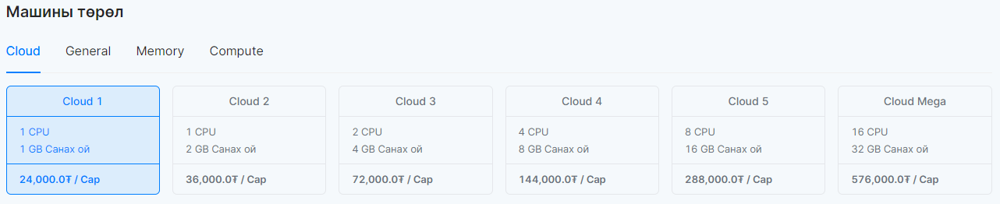

# Сервер (Instance)

Виртуал сервер. Хялбарчлах үүднээс цаашид уг гарын авлагад виртуал серверийг сервер хэмээн нэрлэх болно.

## Сервер үүсгэх

"Клауд виртуал сервер" цэсний **Сервер** цэсрүү орно.

  

Серверийг шинээр үүсгэхдээ **Үүсгэх** товчийг дарна. Гарч ирэх шинэ цонхонд тухайн Серверт холбоотой мэдээлэл болон үзүүлэлтүүдийг сонгох шаардлагатай. Эхлээд **Үйлдлийн систем**ийг сонгоно. **(Хэрэв та windows server үүсгэхийг хүсэж байгаа бол info@cloud.mn-рүү хүсэлт гаргах шаардлагатай байдаг)**

  

Үйлдлийн систем сонгосны дараа Серверийн төрөл буюу хэмжээсийг (vcpu, vram) сонгоно. Серверийн төрөл нь үндсэн 4 хэсэгт хуваагддаг.
<ul>
  <li>Basic server - энгийн хэрэглэгчдэд зориулсан сонголт бөгөөд энгийн хэрэглээ, блог, статик веб, тестийн орчин, санах ойн cache хадгалалт, жижиг систем, энгийн database ажиллуулахад тохиромжтой серверийн төрөл юм.</li>
  <li>Compute server - илүү тооцоолон бодох төрөлд багтдаг, CI/CD application build хийх, видео зурагтай холбоотой процесс хийх, машин сургалт гэх мэт тооцоолон бодох функц ихтэй програм ажиллуулах тохиромжтой серверийн төрөл юм.</li>
  <li>Memory server - илүү хурд болон ачаалал даах төрөл. Өндөр ачаалал бүхий өгөдлгийн сангийн систем, их хэмжээний ачаалал авдаг санах ой их шаардагддаг систем ажиллуулахад тохиромжтой серверийн төрөл юм.</li>
  <li>General server - онлайн худалдаа, мэдээний сайт гэх мэт илүү өндөр ачаалал авдаг, найдвартай ажиллагаа шаардсан системүүд ажиллуулахад тохиромжтой серверийн төрөл юм.</li>
</ul>

  

Бусад мэдээлэл
<ul>
  <li>Серверийн нэр буюу virtual серверийн нэрийг өгнө.</li>
  <li>Хандах эрх талбарт оруулсан username, password-р Server лүүгээ SSH хандалт хийх боломжтой. Мөн хэрэглэгчийн үүсгэсэн keypair-н тусламжтай сервер рүүгээ хандаж болдог. Сервер рүүгээ нэвтрэх талаар [Сервертэй холбогдох] хэсгээс харна уу.</li>
  <li>Дискийн хэмжээ дээр тухай серверт хэрэглэгдэх виртуал дискний хэмжээг оруулна.</li>
  <li>Сүлжээ дээр та Private network-н IP-г ашиглах боломжтой. Эсвэл Автоматаар IP оноох сонголтыг идэвхжүүлснээр CLOUD тухайн үүсгэж буй серверт Public IP хаяг оноож өгөх болно. Тохиргооны тухай дэлгэрэнгүй Auto Assign Ip vs Private network</li>
  <li>Портын Тохиргоо дээр та өөрийн Security Group сонгоно. Энэ нь тухайн сервер нь сонгогдсон Security Group дээр бичигдсэн Портын дүрмүүдийг мөрдөх бөгөөд Портын Тохиргооны тухай дэлгэрэнгүйг дараахаас уншина уу Security Groups</li>
  <li>Бүх тохиргоог сонгосны дараа серверийн үзүүлэлт хэсэгт тухайн сервер тасралтгүй ажиллахад сард гарах мөнгөн дүнг бодож харуулна.</li>
</ul>

Бүх тохиргоо болон үнийн дүнг нягталж үзсэний дараа **Үүсгэх** товчийг дарснаар таны сервер буюу виртуал сервер үүснэ.

  

## Сервер дээрх үйлдлүүд

  

### Серверийг дахин ачаалуулах (Reboot)

Серверийг дахин ачаалуулах (Reboot) хийх бол тухайн серверийг сонгоод **Дахин ачаалуулах(Reboot)** товчийг дарна. Reboot нь 2 төрөл байдаг бөгөөд энгийн (soft reboot) болон хүчээр (hard reboot) гэж ангилагддаг. Hard-н хэрэглэгчийн серверийн процессыг хүлээхгүйгээр шууд хүчээр унтраадаг бол Soft-н хэрэглэгчийн серверийн процессыг хүлээж илүү аюулгүйгээр Reboot хийдэг байна.

### Серверийг унтраах (Shutdown)

Серверийг унтраах (Shutdown) хийх бол тухайн серверийг сонгоод Унтраах(Stop) товчийг дарна.

### Серверийг түр зогсоох (Suspend)

Серверийн одоо ажиллаж байгаа төлвийг тэр чигээр нь хадгалж буюу унтраахгүйгээр pause авах горимыг хэлдэг. Энэ төлөвт байгаа сервер дээр төлбөр боддоггүй. Түр зогсоох гэж буй серверийг сонгоод Түр зогсоох(Suspend) товчийг дарснаар серверийг түр зогсоох боломжтой.

### Түр зогсоосон болон унтарсан серверийг асаах (Resume)

<ul>
  <li>Түр зогсоосон буюу suspend хийсэн серверийг асаахын тулд тухайн серверийг сонгоод Сэргээх(Resume) товчийг дарна.</li>
  <li>Унтарсан буюу stop хийсэн серверийг асаахын тулд тухайн серверийг сонгоод Асаах(Start) товчийг дарна.</li>
</ul>

### Серверийг устгах (Delete)

<ol>
  <li>Серверийг сонгоход Delete товч идэвхжинэ. Та ямар нэг зүйл устгахдаа болгоомжтой хандах шаардлагатайг зөвлөж байна.</li>
  <li>Delete товчийг дарахад жижиг цонх гарж ирэх ба баталгаажуулах үйлдэл буюу Устгах(delete) хэмээн бичсэний дараа Сервер устах болно.</li>
</ol>

### Серверийн хэмжээг өөрчлөх (Resize)

:::caution Анхааруулга 

Серверийг Resize хийхийн тулд та заавал унтраасан байх шаардлагатай.

:::

<ul>
  <li>Клауд виртуал сервер цэсний Сервер цэс рүү орно.</li>
  <li>Хэмжээг өөрчлөх гэж буй серверийг сонгоод Үйлдлүүд(Action) товчийг дарах.</li>
  <li>Үйлдлүүд товчийг дархад Уналттай цэс гарч ирэх ба Серверийн хэмжээг өөрчлөх(Resize) товчийг дарах.</li>
  <li>Resize товчийг дарснаар сонголтууд гарч ирнэ.</li>
  <li>Серверийн төрөл хэсгээс өөрт тохирсон төрлийг сонгох.</li>
</ul>

  

<ul>
  <li>Засах товчийг дарах.</li>
  <li>Серверийн хүснэгт дахин унших ба Өөрчлөлтийг баталгаажуулах товч болж өөрчлөгдсөн байх ба тухайн товчин дээр дарж баталгаажуулах шаардлагатай.</li>
  <li>Баталгаажуулах товчийг дарж баталгаажуулалт хийснээр таны серверийн хэмжээ өөрчлөгдсөн байна.</li>
  <li>Шаардлагатай тохиолдолд серверийг Soft Reboot буюу унтрааж асаах хэрэгтэйг анхаарна уу.</li>
</ul>

### IP хаяг удирдах (Interface manage)

Серверт олон хаяг уях, устгах зэрэг боломжийг олгодог үйлдэл юм. Хаяг нь Private, Public гэсэн сонголттойгоор нэмж болдог

<ol>
  <li>Клауд виртуал сервер цэсний Сервер хэсэг рүү орно.</li>
  <li>Public IP болон Private IP хаяг нэмэх серверийн Үйлдлүүд багана дах товчийг дарах.</li>
  <li>Үйлдлүүд товчийг дархад Уналттай цэс гарч ирэх ба Интерфэйс удирдах товчийг дарах. Ингэснээр шинэ диалог цонх гарч ирнэ.</li>
  <li>Диалог дээрх External товчийг дарснаар тухайн Сервер дээр шинэ Public IP хаяг нэмэгдэж орно.</li>
  <li>Харин сонголыг өөрчлөөд дотоод сүлжээгээ сонгосон тохиолдолд Private IP хаяг нэмэгдэж орно</li>
  <li>Устгах товчин дээр дарснаар мөн IP-г устгах боломжтой.</li>
</ol>

  

### Серверт Floating IP хаяг холбох (Associate Floating IP)

Тогтмол хаяг буюу floating ip нь энгийн IP-г бодвол сервер устсан үед ч хэрэглэгчид үлддэг IP хаягийг хэлдэг. Floating IP нөөцөлж аваад тэрийгээ хүссэн сервертээ залгах байдлаар хэрэглэдэг. Жишээ нь, хэрэглэгч IP-гаа whitelist хийх зэрэг үед хамгийн хэрэгтэй сонголт юм. Энгийн хаягтай серверийн хувьд сервер нь устсан тохиолдолд өөрчлөгдөж random-оор сонгогддог.

:::caution Анхааруулга
Зөвхөн Private сүлжээнд Floating IP хаяг нэмэх боломжтой. 
:::

<ol>
  <li>Клауд виртуал сервер цэсний Сервер хэсэг рүү орно.</li>
  <li>Floating IP хаяг нэмэх Серверийн Үйлдлүүд товчийг дарах.</li>
  <li>Үйлдлүүд товчийг дарснаар Уналттай цэс гарч ирэх ба Тогтмол хаяг удирдах товчийг дарах. Ингэснээр шинэ диалог цонх гарч ирнэ.</li>
  <li>Тогтмол хаяг холбох талбараас оноох Floating IP хаягаа сонгоод Associate товчийг дарах.</li>
</ol>

  

### Диск удирдах (Volume manage)

<ol>
  <li>Клауд виртуал сервер цэсний Сервер хэсэг рүү орно.</li>
  <li>Серверийн Үйлдлүүд товчийг дарах.</li>
  <li>Үйлдлүүд товчийг дархад Уналттай цэс гарч ирэх ба Диск удирдах товчийг дарах. Ингэснээр шинэ диалог цонх гарч ирнэ.</li>
  <li>Диск удирдах талбарт өөр серверт уяагүй дискүүд гарч ирэх бөгөөд нэмэх дискийг сонгож Болсон товчийг дарах.</li>
  <li>Харин салгах товчин дээр дарснаар дискийг тухайн серверээс салгах болно.</li>
</ol>

  

### Портын тохиргоо удирдах (Security group manage)

<ol>
  <li>Клауд виртуал сервер цэсний Сервер хэсэг рүү орно.</li>
  <li>Серверийн Үйлдлүүд товчийг дарах.</li>
  <li>Үйлдлүүд товчийг дархад Уналттай цэс гарч ирэх ба удирдах товчийг дарах. Ингэснээр шинэ диалог цонх гарч ирнэ.</li>
  <li>Талбарт залгагдсан болон залгагдаагүй портын тохиргоонууд гарч ирнэ.</li>
  <li>Хасах тэмдэг дээр дарснаар серверээс тухайн тохиргоог салгана.</li>
  <li>Нэмэх тэмдэг дээр дарснаар серверт тухайн тохиргоог залгана.</li>
  <li>Тохиргооны товчин дээр дарснаар тухайн тохиргооны портуудыг удирдах боломжтой</li>
</ol>

  
