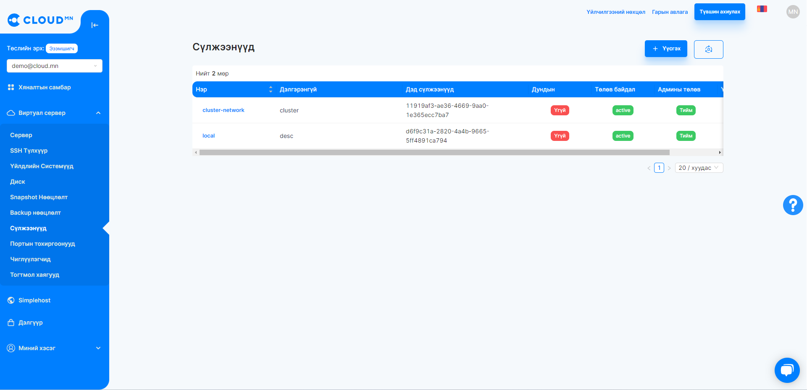
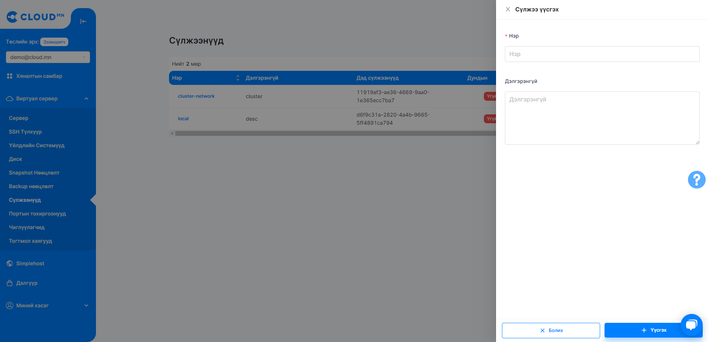
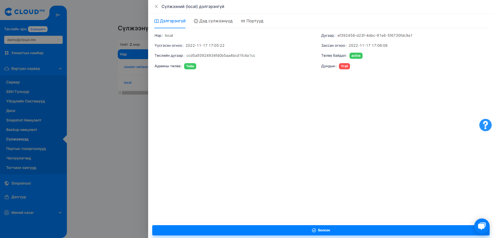
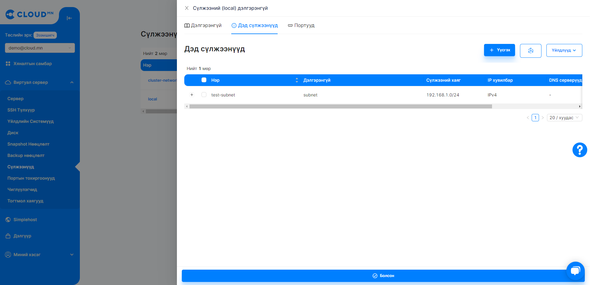
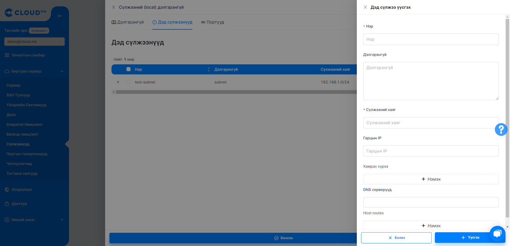
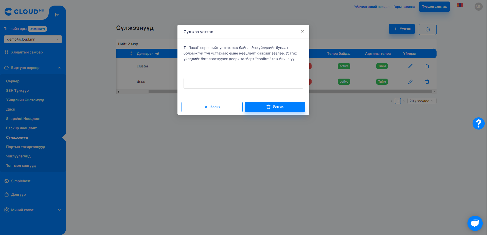
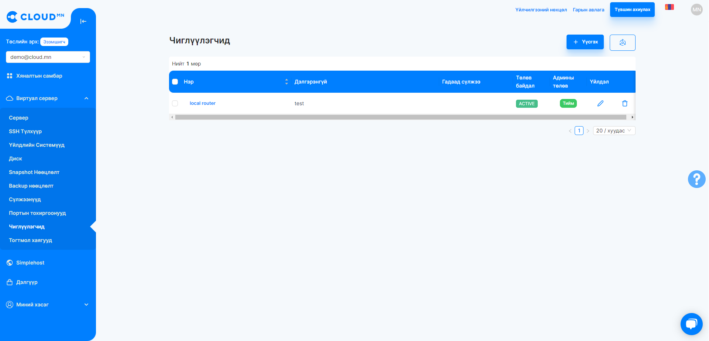

# Сүлжээ

## Сүлжээ

Сүлжээ цэсээс Private сүлжээ үүсгэх болон удирдах боломжтой.

  

### Private сүлжээ үүсгэх

<ol>
    <li><b>Үүсгэх</b> товч дээр дарах</li>
    <li>Private сүлжээ үүсгэх шинэ диалог цонх гарч ирэх ба <b>Нэр</b> талбар дээр үүсгэх сүлжээний нэрийг оруулах</li>
    <li><b>Үүсгэх</b> товч дээр дарж Private сүлжээ үүсгэнэ. Private сүлжээнд байрших серверүүд хоорондоо дотоод сүлжээний хаягаар холбогдох боломжтой байдаг. Харин түүнийг Public IP хаягтай болгох тухай <a href='./floating'>Тогтмол хаяг (Floating IP)</a> хэсгээс дэлгэрэнгүй харна уу.</li>
</ol>

  

Private сүлжээ нь үүсэхдээ ямар нэг <b>дэд сүлжээ</b> байхгүй хоосон үүсдэг ба дэд сүлжээгүйгээр сервер асаах боломжгүй байдаг.

### Private сүлжээнд дэд сүлжээ үүсгэх

<ol>
    <li>Тухайн Private сүлжээний нэр дээр дарж орох</li>
</ol>

  

<ol start='2'>
    <li><b>Дэд сүлжээнүүд</b> хэсгийг сонгож орох</li>
</ol>

  

<ol start='3'>
    <li><b>Үүсгэх</b> товч дээр дарах</li>
    <li>Шинээр <b>дэд сүлжээ</b> үүсгэхэд доор талбаруудыг заавал оруулах шаардлагатай.</li>
    <ol>
        <li><b>Нэр</b> - Тухайн дэд сүлжээний нэр</li>
        <li><b>Сүлжээний хаяг</b> - Тухайн дэд сүлжээ ямар IP хаягийн pool-тай байхыг зааж өгнө. Сүлжээний prefix буюу Mask заавал зааж өгөх шаардлагатай. Жишээ нь 192.168.1.0/24</li>
        <li><b>Гарцын IP</b> - Тухайн дэд сүлжээнд гарцын IP/Gateway IP/ тохируулах. Жишээ нь 192.168.1.1</li>
    </ol>
    <li>Дээрх талбаруудыг оруулаад <b>Үүсгэх</b> товчийг дарж үүсгэх.</li>
</ol>

  

### Private сүлжээ устгах

<ol>
    <li>Сүлжээнүүд цэс рүү орох</li>
    <li>Устгах сүлжээг сонгож үйлдэл хэсгээс <b>Delete</b> товчийг дарах</li>
</ol>

:::caution Анхааруулга
Сүлжээ устгахын тулд дэд сүлжээнүүд болон ашиглагдаж байгаа порт зэргийг бүгдийг нь устгасан байх шаардлагатай.
:::

  

### Автоматаар IP оноох болон Private сүлжээний харьцуулалт

Сервер үүсгэх явцад сүлжээ талбарт default-р Автоматаар IP оноох сонгогдсон байдаг. Автоматаар IP оноох сонгосон үед тухайн сервер анхнаасаа Public IP хаягтай үүсдэг ба ямар нэг Private сүлжээнд холбогдохгүй гэсэн тохиргоо юм. Харин Private сүлжээнд сервер үүсгэх тохиолдолд Сүлжээ талбарын Автоматаар IP оноох сонголтыг идэвхгүй болгож Private сүлжээ сонгон тухайн серверийг уг сүлжээ дотор үүсгэх боломжтой. Private сүлжээнд байрших серверүүд хоорондоо дотоод сүлжээний хаягаар холбогдох боломжтой байдаг. Харин түүнийг Public IP-тай болгох тухай Тогтмол хаягууд (Floating IP) хэсгээс дэлгэрэнгүй харна уу.

## Чиглүүлэгч (Router)

Чиглүүлэгч нь Routing, NAT гэх мэт Virtual Layer 3 үйлчилгээ үзүүлдэг.

  

### Чиглүүлэгч үүсгэх

<ol>
    <li><b>Виртуал сервер</b> цэсний <b>Чиглүүлэгч</b> цэсрүү орох</li>
    <li><b>Үүсгэх</b> товч дээр дарах үед шинэ диалог цонх гарч ирнэ.</li>
    <li><b>Үүсгэх</b> товч дээр дарах үед шинэ диалог цонх гарч ирнэ.</li>
    <ol>
        <li><b>Нэр</b> - Тухайн дэд сүлжээний нэр</li>
        <li><b>Сүлжээний хаяг</b> - Тухайн дэд сүлжээ ямар IP хаягийн pool-тай байхыг зааж өгнө. Сүлжээний prefix буюу Mask заавал зааж өгөх шаардлагатай. Жишээ нь 192.168.1.0/24</li>
        <li><b>Гарцын IP</b> - Тухайн дэд сүлжээнд гарцын IP/Gateway IP/ тохируулах. Жишээ нь 192.168.1.1</li>
    </ol>
    <li>Дээрх талбаруудыг оруулаад <b>Үүсгэх</b> товчийг дарж үүсгэх.</li>
</ol>

  