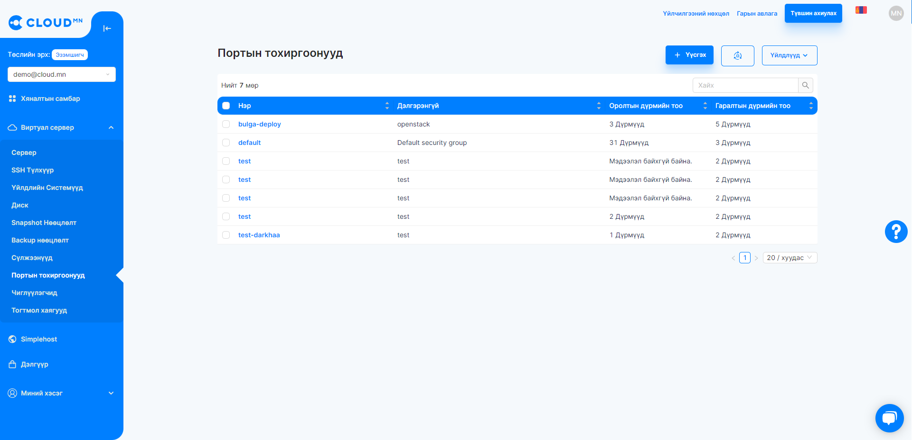
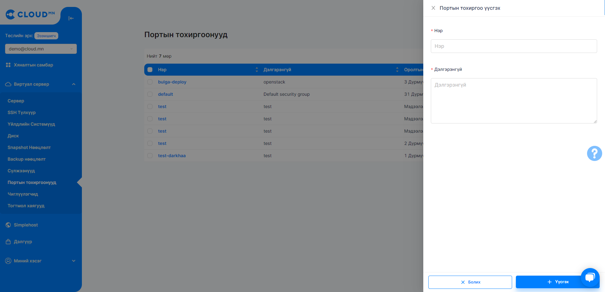
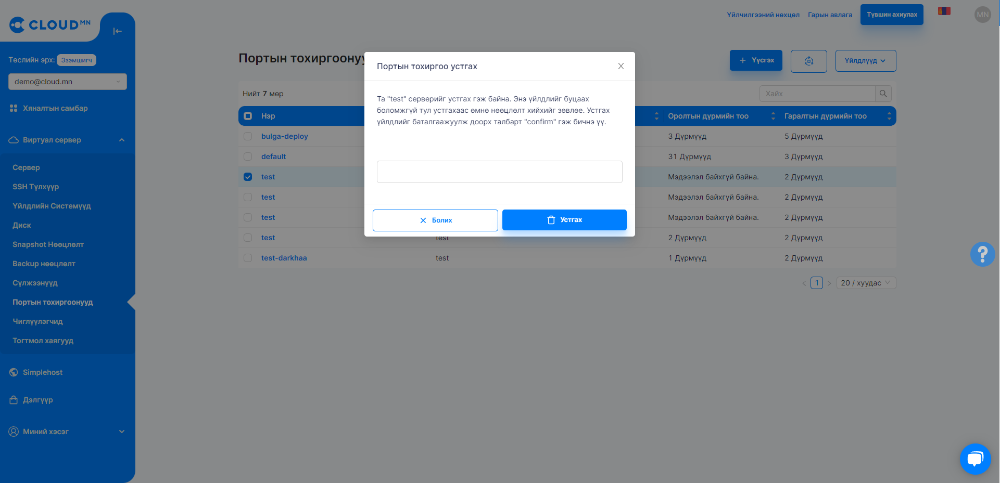
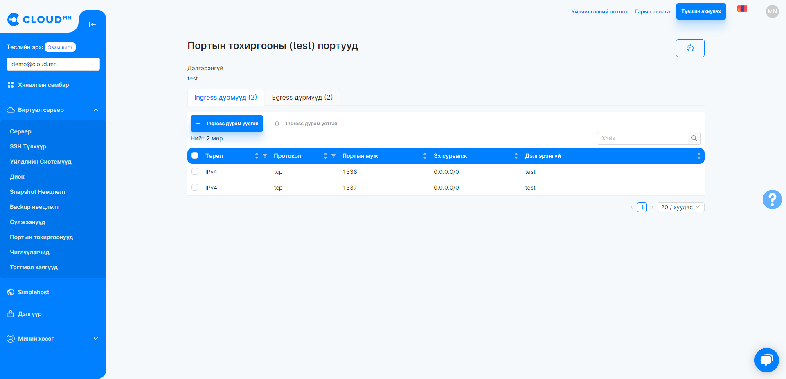
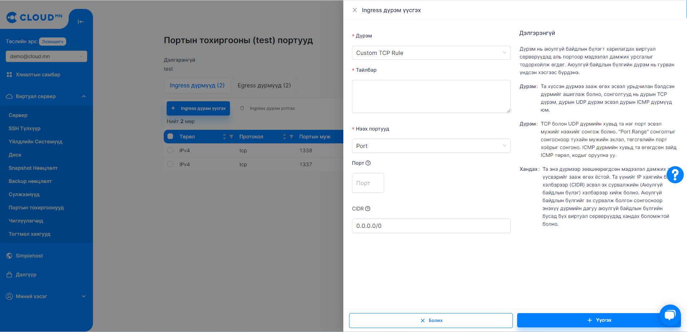
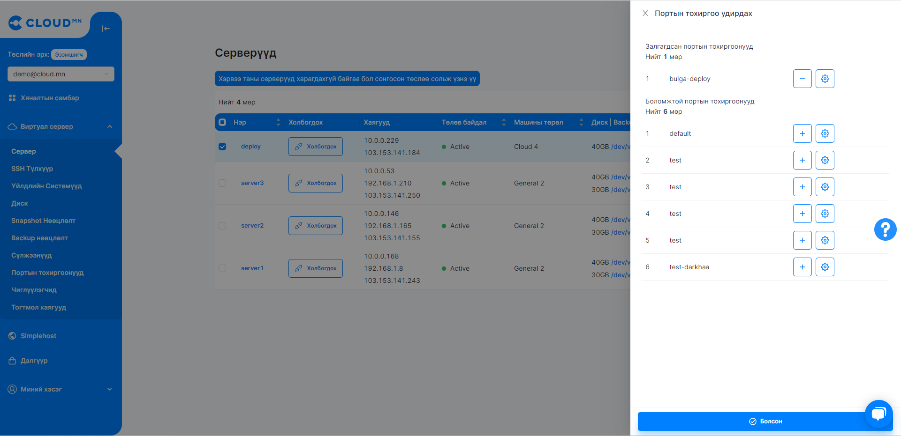

# Портын тохиргоо (Security Group)

## Security Groups
Security Group нь ingress (Instance-д зориулсан Inboud) болон outgress(Instance-д зориулсан Outbound)-г port-н түвшинд сүлжээний урсгалыг хянах зориулалттай Virtual Firewall-уудын цуглуулга юм. Virtual Firewall нь тухайн порт урсгалыг нээх/хаах Rule-үүдээс бүрддэг. Жишээ нь: Instance-н 8080 порт руу дэлхий дээрх бүх host-с хандах боломжтой эсвэл тодорхой хэдэн IP хаяг бүхий host-с хандахыг зөвшөөрөх rule-г хийж болдог.

  

### Портын тохиргоо үүсгэх

<ol>
    <li>Вирутал сервер цэснээс Портын тохиргоонууд цэсрүү орох.</li>
    <li>Үүсгэх товчин дээр дарах энэ үед шинэ диалог цонх гарч ирнэ.</li>
    <li>Нэр болон дэлгэрэнгүй талбарыг оруулаад Үүсгэх товчийг дарж шинэ Портын тохиргоог үүсгэнэ.</li>
</ol>

  

### Портын тохиргоо устгах

<ol>
    <li>Вирутал сервер цэснээс Портын тохиргоонууд цэсрүү орох.</li>
    <li>Хүснэгтээс устгах Портын тохиргоонуудыг сонгох</li>
    <li>Портын тохиргоо сонгосноор Устгах товч идэвхжинэ.</li>
    <li>Тухайн товчийг дараад бичилт хийх талбарт Confirm гэж бичих буюу устгах үйлдлийг баталгаажуулна.</li>
    <li>Диалогын баруун доод буланд Delete товчийг дарж устгана..</li>
</ol>

  

### Портын тохиргоо дүрэм удирдах

Дүрэм нь порт, тайлбар, төрөл, CIDR  хэмээх талбаруудаас бүрдэнэ.

<ul>
    <li>Порт - Хэрэгжих порт. Дан ганц портоос гадна Портын муж буюу олон порт оруулж болдог.</li>
    <li>Дэлгэрэнгүй - Тухайн дүрмийн тайлбар.</li>
    <li>Төрөл - Доорх хоёр төрөл байж болно.</li>
    <ul>
        <li>Ingress - Гаднаас тухайн портруу хандах эрхийг нээх тохиргоо</li>
        <li>Egress - Дотроос тухайн портоор дамжуулан гадагшаа хандах эрхийг нээх тохиргоо</li>
    </ul>
    <li>CIDR - Тухайн дүрэм хэрэгжих IP хаягийн цар хүрээ</li>
</ul>

  

#### SSH порт нээх

<ol>
    <li>Виртуал сервер цэсээс Портын тохиргоо сонгож орох.</li>
    <li>Үүсгэх дүрмийн төрөлөө сонгох.</li>
    <li>Дүрэм үүсгэх товч дээр дарах үед шинэ диалог цонх гарч ирнэ.</li>
    <li>Дүрэм талбараас SSH протоколыг сонгох</li>
    <li>Дүрмийн тайлбарыг бичих</li>
    <li>CIDR буюу хэрэгжих IP хаягийн цар хүрээг бичих</li>
    <li>Диалогын баруун доод буланд байрлах Үүсгэх товчийг дарж хадгалах.</li>
</ol>

  

### Сервер дээр портын тохиргоо нэмэх

<ol>
    <li><b>Виртуал сервер</b> цэснээс <b>Сервер</b> цэсийг сонгоно.</li>
    <li>Портын тохиргоо нэмэх гэж буй Серверийг сонгож <b>Портын тохиргоо удирдах</b> товч дээр дарах</li>
    <li><b>Портын тохиргоо удирдах</b> товч дээр дарснаар шинэ диалог цонх гарч ирнэ.</li>
    <li>Боломжтой портын тохиргоонууд талбараас нэмэх гэж буй Портын тохиргоог сонгох.</li>
    <li>Диалогын баруун доод буланд байрлах <b>Болсон</b> товчийг дарж хадгална.</li>
</ol>

  