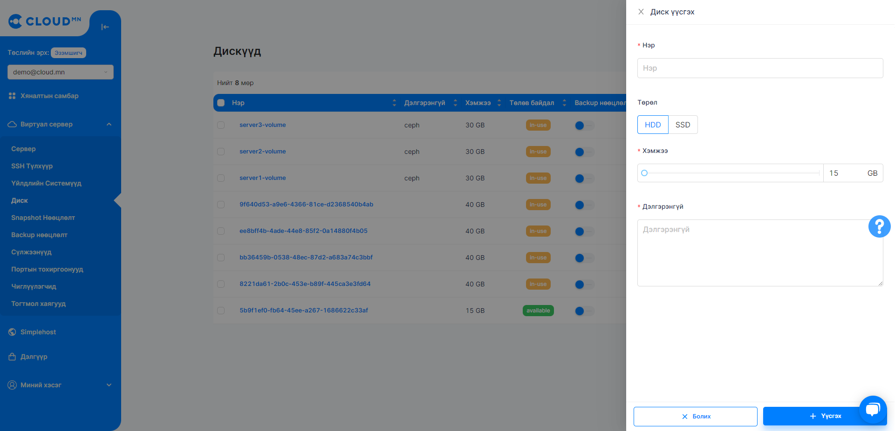
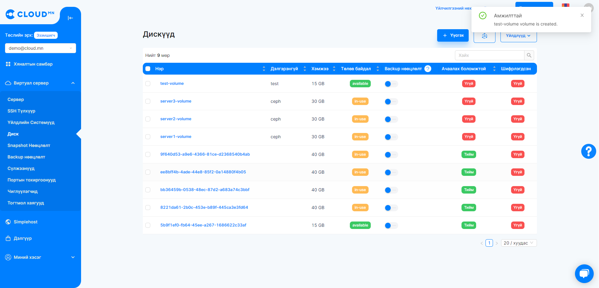
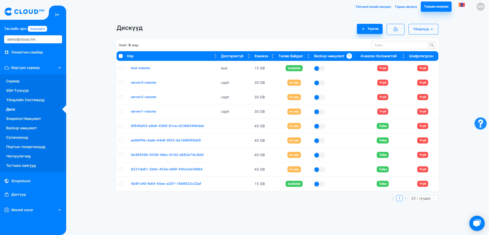
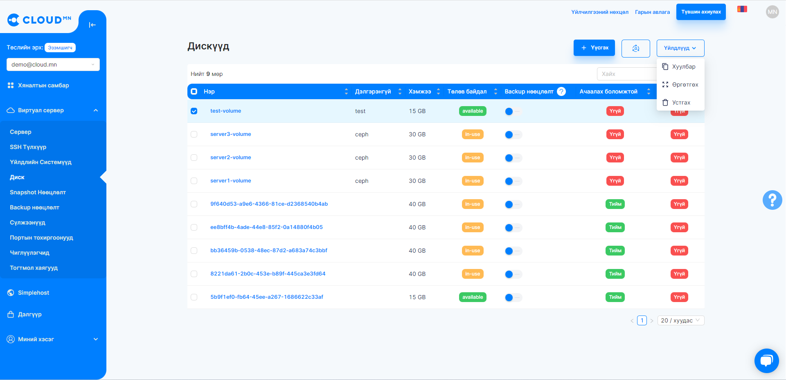
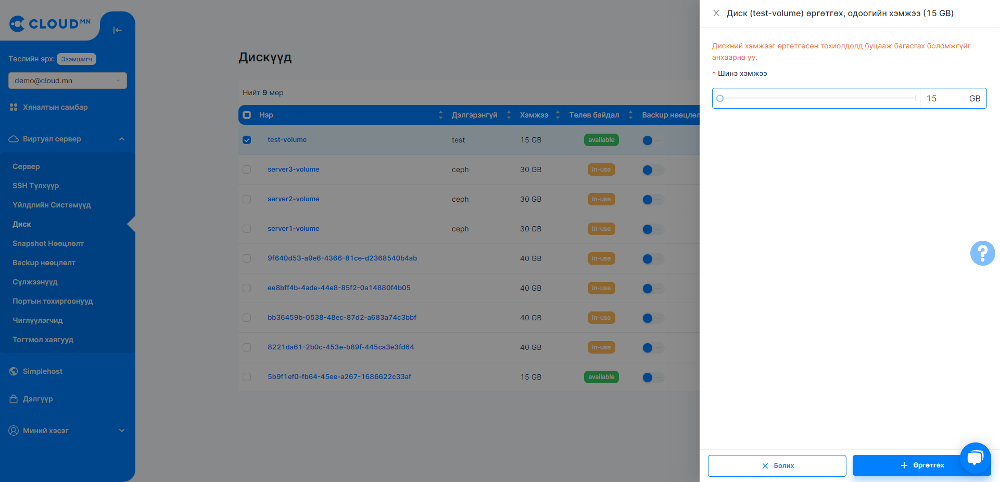
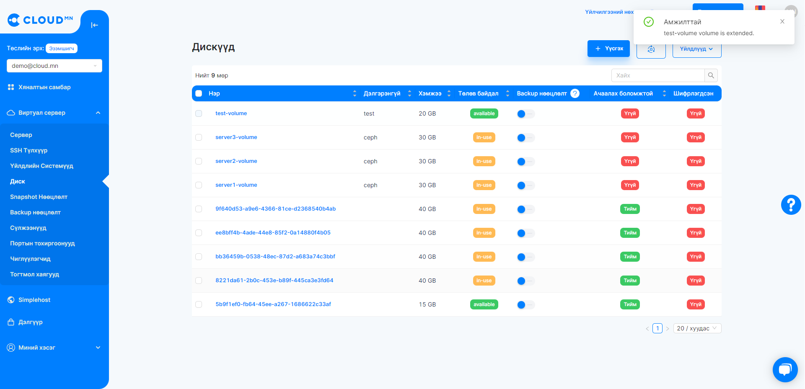
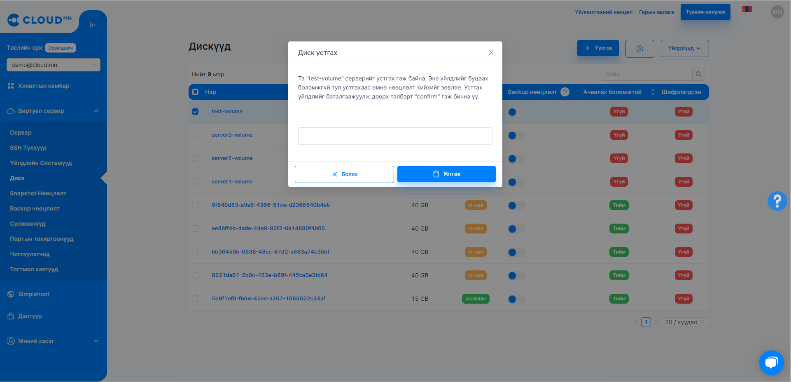
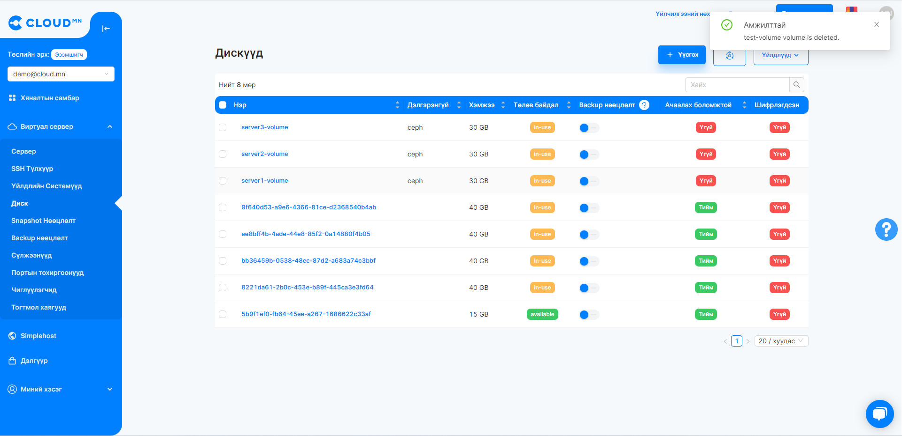
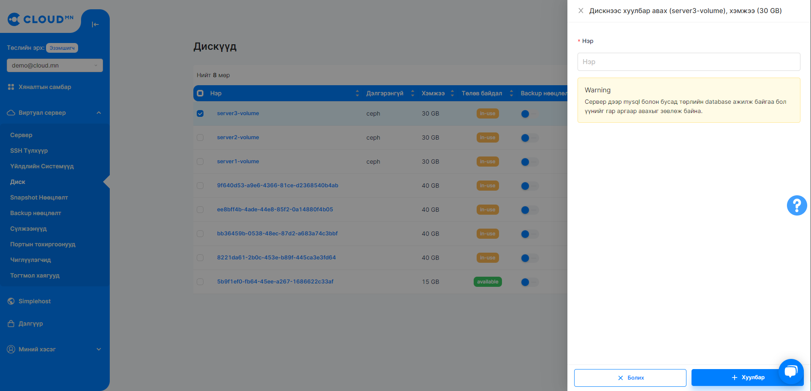

# Диск (Volume)

## Диск цэсний үйлдлүүд

### Виртуал диск үүсгэх

<ol>
    <li>Volume буюу виртуал дискийг үүсгэхдээ Диск цэсийг сонгож орно.</li>
</ol>

  

<ol start='2'>
    <li>Үүсгэх товчийг дарах үед дараах цонх нээгдэнэ.</li>
</ol>

  

<ol start='3'>
    <li>Мэдээллийг бөглөх</li>
</ol>

<ul>
    <li>Нэр хэсэгт виртуал диск-н нэрийг бичнэ.</li>
    <li>Төрөл хэсэгт виртуал диск-н төрлийн сонгоно.</li>
    <li>Хэмжээ хэсэгт виртуал диск-н багтаамжийг сонгох ба хамгийн багадаа 10GB байна.</li>
    <li>Дэлгэрэнгүй хэсэгт виртуал диск-н тайлбарыг бичих боломжтой.</li>
</ul>

Дараах хэсгүүдийг бөглөөд **Үүсгэх** товчийг дарснаар виртуал диск үүсгэх процесс эхлэнэ.

  

Хэсэг хугацааны дараа виртуал диск амжилттай үүснэ.

  

:::caution Анхааруулга
Хэрэглэгч бүр системээс зөвшөөрөгдсөн Дисктийн дээд хэмжээ гэж байдаг тул их хэмжээтэй диск үүсгэх боломжгүй. Дэлгэрэнгүй мэдээллийг <a href="./instance#серверийг-унтраах-shutdown">Том хэмжээний сервер үүсгэх тохиолдолд яах вэ?</a> эндээс авна уу.
:::

### Виртуал дискний багтаамж нэмэх

:::caution Анхааруулга
Хэрвээ тухайн виртуал диск ямар нэг серверт харьяалагдаж байвал багтаамж нэмэхийн тулд та тухайн серверийг <a href="">унтраасан</a> байх шаардлагатай.
:::

<ol>
    <li>Виртуал дискээ сонгоно.</li>
</ol>

  

<ol start='2'>
    <li>Өргөтгөх товчийг дарахад дараах цонх нээгдэнэ. Виртуал дискийн одоогийн хэмжээ харагдах ба тухайн хэмжээг багасгах боломжгүй, зөвхөн ихэсгэх л боломжтой. Шинэ хэмжээ хэсэгт шинэ хэмжээг оруулан Өргөтгөх товчийг дарна.</li>
</ol>

  

<ol start='3'>
    <li>Өргөтгөх товчийг дарсны дараа багтаамжийг ихэсгэх процесс эхэлнэ.</li>
</ol>

  

<ol start='4'>
    <li>Багтаамж ихэсгэх процесс дуусмагц виртуал дискийн багтаамж амжилттай ихэссэн байх болно.</li>
</ol>

  

<ol start='5'>
    <li>Виртуал дискийн хэмжээ ихэссэн хэдий ч үйлдлийн систем дээр оруулж ирэхэд серверийг унтрааж асаах болон Диск удирдах нэмэлт үйлдлүүд хийх шаардлагатай. Үйлдлийн систем тус бүр дээр өөр өөр заавраар хийгддэгийг анхаарна уу.</li>
</ol>

### Виртуал дискийг устгах

<ol start='1'>
    <li>Виртуал дискийг устгахдаа эхлээд устгах гэж буй дискийн Үйлдэл баганад буй улаан товчийг дарах эсвэл дискээ сонгоод Диск устгах товчийг дарна.</li>
</ol>

  

<ol start='2'>
    <li>Улаан товчийг дарсны дараа дараах цонх нээгдэх ба баталгаажуулах үйлдэл хийж Delete товчийг дарна.</li>
</ol>

  

<ol start='3'>
    <li>Хэсэг хугацааны дараа виртуал диск устсан байх болно.</li>
</ol>

### Виртуал дискийн хуулбарыг хадгалах (Snapshot)

<ol>
    <li>Виртуал сервер цэсний Диск цэсрүү орно.</li>
    <li>Хуулбар хийх дискийг сонгож Хуулбар товчийг дарна. Ингэснээр шинэ диалог цонх гарч ирнэ.</li>
    <li>Нэр талбар дээр тухайн Хуулбарын нэрийг бичээд Хуулбар товчийг дарах.</li>
</ol>

  