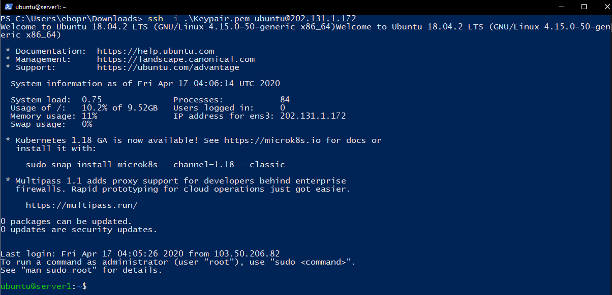
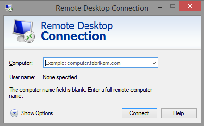

# Connecting to the server (Instance)

For simplicity, the instances will be referred to as a server in this guide.</li>

## Create server (Create)

<ol>
    <li>Enter the <b>Server</b> menu in the <b>"Virtual Server"</b>.</li>
    <li>Click the <b>Connect</b> button.</li>
    <li>Fields will display relevant information and direct links to the web console.</li>
    <li>By clicking on it, a new browser tab will open and you can directly access the server.</li>
</ol>

  

<hr></hr>

## Connecting to an external server

### Create a keypair

<ol>
    <li>A Keypair can be created when an instance is created. Also click the <b>Create Key Pair</b> button from the <b>Key pairs menu</b>.</li>
</ol>

  

<ol start='2'>
    <li>Type the name of the Keypair you want to create and click <b>Create</b>. The keypair will then be generated and the .pem file will be downloaded to your browser.</li>
</ol>

  

<ol start='3'>
    <li>Use the keypair you created. Click the enter button and a field will appear where you can enter the name and public key.</li>
    <li>Instructions on how to generate SSH-keygen will also appear.</li>
</ol>

  

<hr></hr>

## Remote connection to Instance

### Connect to Instance using Keypair

:::caution Анхааруулга :::
Remote буюу Web Console-с өөр газраас серверлүү хандахад Public IP хаяг зайлшгүй хэрэгтэй бөгөөд үүний тухай дараах бичиг баримтаас үзнэ үү <a href="./instance#ip-хаяг-удирдах-interface-manage">Серверт Public IP хаяг нэмэх</a>, Серверээ Private сүлжээтэй үүсгэсэн бол <a href="./instance#серверт-floating-ip-хаяг-холбох-associate-floating-ip">Серверт тогтмол хаяг нэмэх</a>. Хэрвээ тухайн серверийн портын тохиргоо дээр SSH port нээгээгүй байвал холбогдох боломжгүйг анхаарна уу! Портын тохиргоо буюу виртуал галт хана дээр SSH port нээх шаардлагатай байдаг ба дараахаас харна уу <a href="./security">SSH Port нээх, Серверт портын тохиргоо нэмэх</a>.

<ol>
    <li>Сервер үүсгэхдээ Хандах эрх хэсэг SSH түлхүүр хэмээх сонголтыг бөглөж, өөрийн үүсгэхэд SSH түлхүүр-үүдээс сонгож тухайн сервер дээр уяж өгнө.</li>
    <li>Өөрийн РС дээр хадгалагдсан SSH түлхүүр-н private key file (.pem file) байгаа directory дээр очиж command shell нээгээд дараах командыг бичнэ.</li>
</ol>

```bash
chmod 400 .\NAME.pem
ssh -i .\NAME.pem IMAGETYPE@IP
```

Жишээ нь таны Ubuntu үйлдлийн систем бүхий сервер 202.131.1.110 IP хаяг дээр ажиллаж байх тохиолдолд

:::caution Анхааруулга
Ubuntu системээс серверлүү холбогдох үед тухайн .pem файл зөвхөн read permission-тэй байхыг шаарддаг тул chmod 400 командыг ажиллуулах шаардлагатай.
:::

```bash
chmod 400 .\NAME.pem
ssh -i .\NAME.pem ubuntu@202.131.1.110
```

  

<hr></hr>

### Хэрэглэгчийн нэр, нууц үг ашиглан нэвтрэх

:::tip Зөвлөгөө
Хэрвээ хэрэглэгчийн нэр, нууц үг ашиглаж нэвтрэхэд Web Console ба SSH гэх хоёр төрлөөр нэвтрэх боломжтой.
:::

#### Web Console-р нэвтрэх

<ol>
    <li>Сервер цэсрүү ороод холбогдох гэж буй серверийн ард байрлах <b>Холбогдох</b> товчийг дарна. Энэ нь сервер лүү холбогдоход хамгийн амархан арга бөгөөд copy болон paste үйлдэл хийгдэх боломжгүйг анхаарна уу!!!</li>
    <li>Дараах цонх нээгдэх ба сервер үүсгэхдээ <b>Хандах эрх</b> хэсэгт бичсэн хэрэглэгчийн нэр, нууц үгийг ашиглаж нэвтрэнэ.</li>
</ol>

  

<ol start='3'>
    <li>Хэрэглэгчийн нэр, нууц үгийг зөв оруулсны дараа сервер лүү холбогдоно.</li>
</ol>

  

#### SSH аргаар нэвтрэх
<ol>
    <li>Сервер үүсгэхдээ <b>Хандах эрх</b> талбарыг Нууц үг гэж сонгоод өөрийн ашиглах хэрэглэгчийн нэр, нууц үгийг оруулж өгөх.</li>
    <li>Сервер рүүгээ SSH-р холбогдохдоо shell эсвэл terminal дээр ээ доорх командыг ажиллуулна.</li>
</ol>

```bash
ssh user_name@public_ip
```
<ol start='3'>
    <li>Тохируулсан нууц үгийг оруулж SSH-р амжилттай нэвтэрнэ.</li>
</ol>

<hr></hr>

### Windows Server үйлдлийн систем бүхий серверлүү Remote Desktop Connection (RDP)-р холбогдох

:::caution Анхааруулга
Та RDP-р холбогдохын тулд тухайн серверийн холбосон Портын тохиргоо дээр RDP порт буюу 3389 port-г нээх шаардлагатай. Портын тохиргоо хэсгээс дэлгэрнгүйг уншина уу.
:::

<ol>
    <li>Та Windows Server-тэй сервер асаамагц юун түрүүнд заавал Web Console-р холбогдоно. Системийн хамгийн анхны хэрэглэгчийн хэрэглэгчийн нэр, нууц үгийг тохируулж өгөх шаардлагатай.</li>
    <li>Windows server лүү холбогдох гэж буй client-с Remote Desktop Connection нээх.</li>
</ol>

  

<ol start='3'>
    <li>Computer талбарт серверийн Public IP хаягыг оруулж өгөх.</li>
</ol>

  

<ol start='4'>
    <li>Connect хийхэд холбогдох хэрэглэгчийн credentials асуух бөгөөд эхний алхам дээр тохируулсан хэрэглэгчийн нэр болон нууц үгийг ашиглан нэвтэрнэ.</li>
</ol>

  

<ol start='5'>
    <li>Хэрвээ Credssp-тэй холбоотой алдаа гарах тохиолдолд. <a href="https://www.youtube.com/watch?v=Mp9vPS4Efto">How to Fix Credssp Encryption Oracle Remediation Error | Remote Desktop Connection</a> энэхүү заавар хэрэг болно.</li>
</ol>
