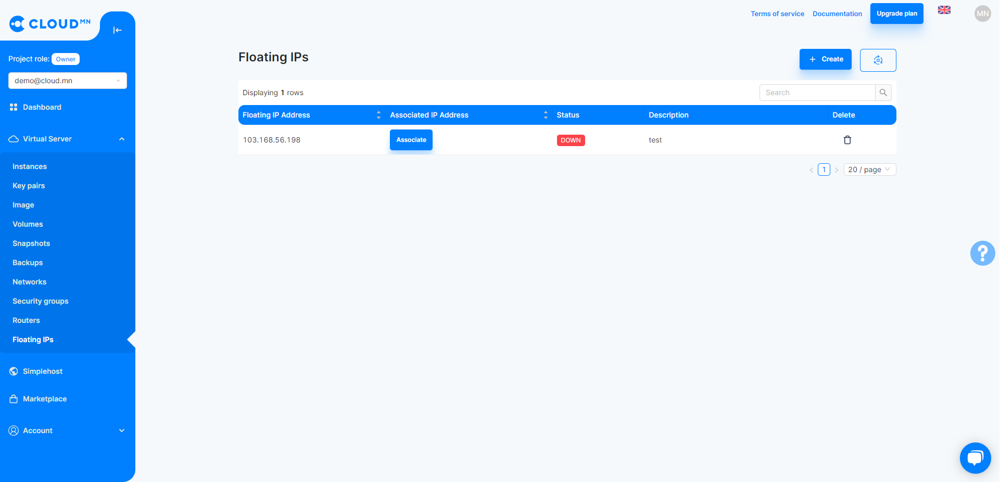
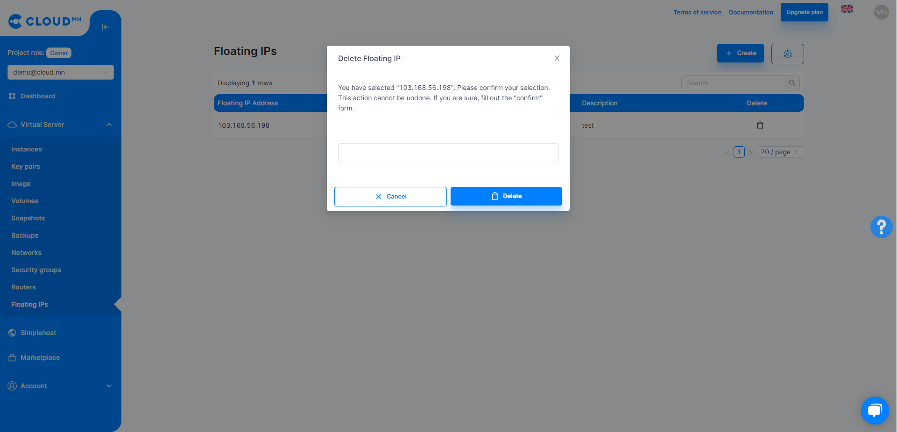
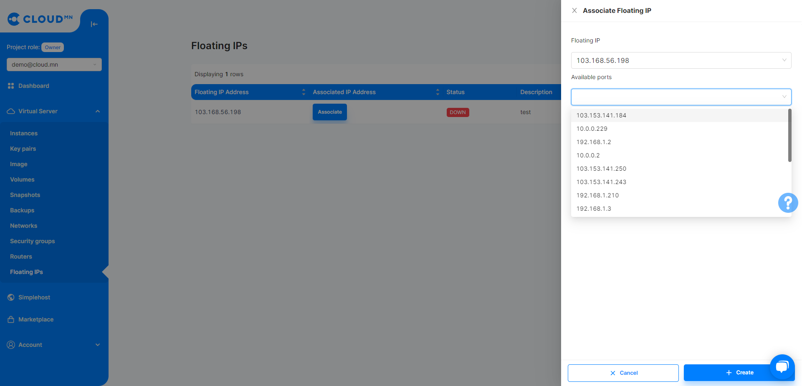

# Fixed address (Floating IP)

## Floating IP

Floating IP allows you to reserve a Public IP address. It is used to make the Instance created on the Private Network have a Public IP address, and it is possible to separate the IP address and connect it to another Instance.

  

### Create a floating IP address

<ol>
    <li>Enter the <b>Floating IPs</b> menu from the <b>Virtual Server</b> menu.</li>
    <li>Clicking on the <b>Create</b> button will bring up a new dialog box.</li>
    <li>Enter the Description field.</li>
    <li>Click the <b>Create</b> button in the lower right corner to create a Floating IP.</li>
</ol>

  

### Release floating IP address

<ol>
    <li>Enter the <b>Floating IPs</b> menu from the <b>Virtual Server</b> menu.</li>
    <li>Press the <b>Delete</b> button on the right side of the button located in the Action line of the IP address to be released.</li>
    <li>Click the Release Floating IP button and click the Delete IP button on the dialog that appears.</li>
</ol>

  

### Associate a Floating IP address with an Instance

There are two ways to connect a Floating IP address to an Instance.
:::tip Tips
<ul>
<<<<<<< HEAD
    <li>Арга 1: <a href='/userguide/instance#серверт-Floating-IP-хаяг-холбох-associate-floating-ip'>Серверт тогтмол хаяг нэмэх</a></li>
    <li>Арга 2: Тогтмол хаяг цэсээс холбох</li>
=======
    <li>Method 1: <a href='/userguide/instance#серверт-floating-ip-хаяг-холбох-associate-floating-ip'>Add a Floating IP address to the Instance.</a></li>
    <li>Method 2: Connect from the Floating IP menu.</li>
>>>>>>> 48f294e68d8cd4f82684bfd1991ca8c5bc003f9f
</ul>
:::

<ol>
    <li>Enter the <b>Floating IP</b> menu from the <b>Virtual Server</b> menu.</li>
    <li>Click the <b>Associate</b> button in the Action line of the IP address you want to connect from the table.</li>
    <li>In the new dialog that appears, select the IP address of the Instance to be connected from the Port to the associated field.</li>
    <li>Click the <b>Create</b> button in the lower right corner to bind to that Instance.</li>
</ol>

  

