# Server (Instance)

For simplicity, the instances will be referred to as a server in this guide.

## Create Instance

1. Enter the **Instances** menu in the **Virtual Server** menu. To create a new server, click the Create button.

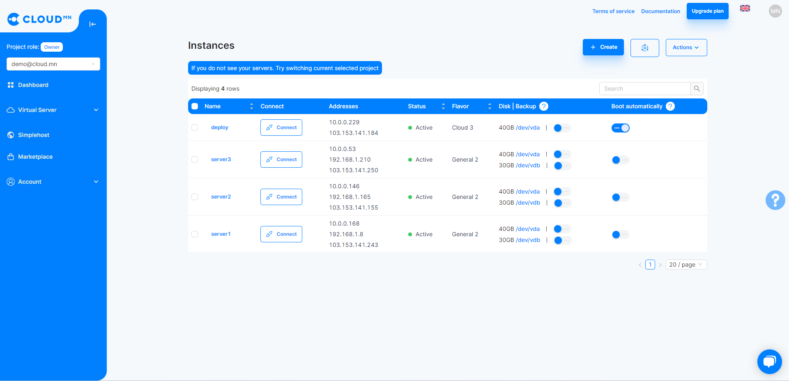

2. In the new window that appears, you need to select information and parameters related to the server. First choose **Operation System**.

:::info 
**If you want to create a windows server, you need to send a request to <a href='mailto:info@cloud.mn'>info@cloud.mn</a>**
:::

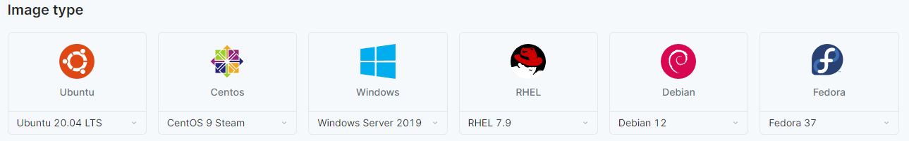

3. After selecting the operating system, select the server type or size (vCPU, vRAM). Server types are divided into 4 main categories.

- **Basic server** - an option for simple use, it is a type of server suitable for simple applications, blogs, static web, test environment, memory cache storage, small systems and simple database.
- **General server** - a type of server that is suitable for running systems that require high traffic and reliability, such as online shopping and news site.
- **Memory server** - more speed and load handling type. This type of server is suitable for running high-load database systems and memory-intensive systems that take a lot of load.
- **Compute** - a type of server that is more computational, suitable for running applications with a lot of computational power, such as CI/CD application building, video processing, machine learning, etc.

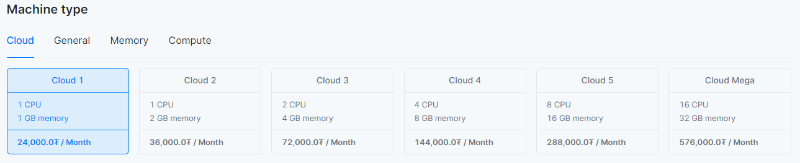

4. Other information

- Give the **name of the server** or the name of the virtual server.
- **SSH access** to the server can be done with the username and password entered in the access rights field. It is also possible to access the server with the help of a keypair created by the user. For access to your server, see <a href="/userguide/connect-to-instance">Connecting to Server</a>.
- Under **Disk size**, enter the size of the virtual disk to be used for that server.
- On the **Network**, you can use the Private network IP. Alternatively, by enabling the **automatic IP assignment** option, the CLOUD server will assign a Public IP address to the creating server. Auto Assign Ip vs Private network for details on configuration<a href="/userguide/network#автоматаар-ip-оноох-болон-private-сүлжээний-харьцуулалт">Auto Assign IP vs Private Network</a>.
- In **Port Settings**, you select your Security Group. The server will follow the port rules listed in the selected Security Group, see Security Groups for details on Port Configuration <a href="/userguide/security">Security Groups</a>.
- After selecting all the settings, in the server parameters section, the estimated amount of money that the server will cost in a month of continuous operation will be displayed.

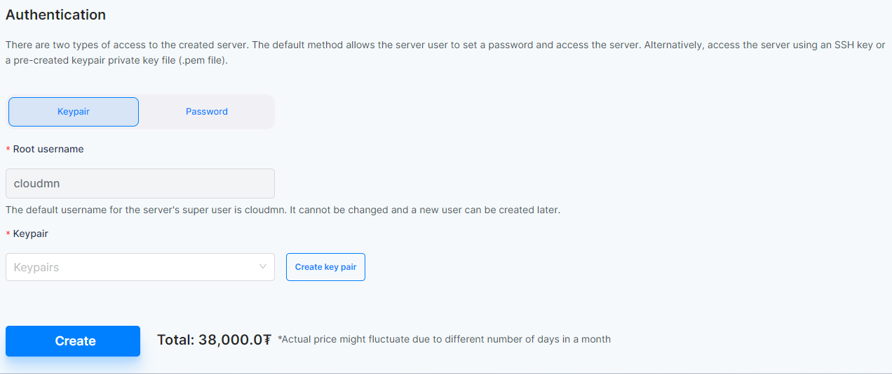

After reviewing all settings and pricing, click the **Create** button to create your virtual server.

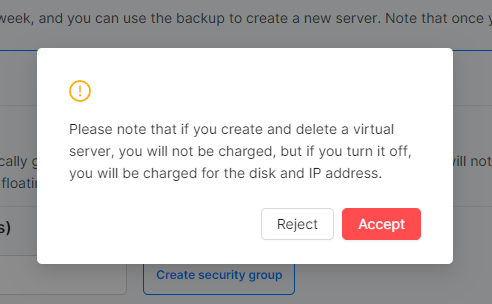

## Server Actions

  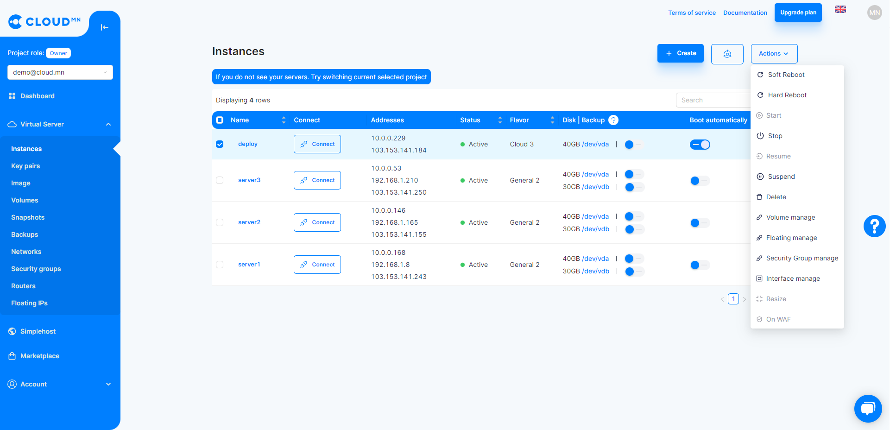

### Reboot the Server

To reboot the server, select the server and click the **Reboot** button. There are two types of reboots, soft reboot and forced hard reboot. Hard forces immediate shutdown without waiting for the user server process, while Soft reboots more safely while waiting for the user server process.

### Turn off the Server(Shutdown) 

To shutdown the server, select the server and click Stop.

### Suspend the Server

It refers to the mode of taking a pause without shutting down or saving the current state of the server. In this state, the server is not charged, and only hard and IP are charged. You can suspend the server by selecting the server you want to suspend and clicking the **Suspend** button.

### Resume Suspended and Shutdown Servers

- To restart a suspended server, select the server and press the **Resume** button.
- To turn on a server that is turned off or stopped, select the server and press the **Start** button.

### Delete the Server 

1. When the server is selected, the Delete button becomes active. We recommend that you use caution when deleting anything.
2. When you press the Delete button, a small window will appear, and after the confirmation action or delete, the Server will be deleted.

### Resize the Server 

:::caution  
You must turn off the server to resize it.
:::

<ul>
  <li>Go to the <b>Instances</b> menu in the <b>Virtual Server</b> menu.</li>
  <li>Select the server you want to resize and click the <b>Actions</b> button.</li>
  <li>Click the Actions button and a drop-down menu will appear, and click the <b>Resize Server</b> button.</li>
  <li>Click the Resize button to display the options.</li>
  <li>Select the appropriate type from the Server Type section.</li>
</ul>

  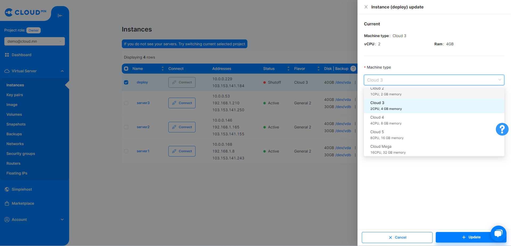

<ul>
  <li>Click the <b>Edit</b> button.</li>
  <li>When the server table changes to <b>Update button</b>, you need to click on that button to <b>Verify Size</b>.</li>
  <li>Click the <b>Confirm</b> button to verify that your server size has been changed.</li>
  <li>Note that if necessary, the server should be Soft Rebooted or restarted.</li>
</ul>

### IP address management (Interface manage)

It is an action that allows the server to bind and delete multiple addresses. The address can be added as Private or Public.

<ol>
  <li>Go to the <b>Instances</b> section of the <b>Virtual Server</b> menu.</li>
  <li>To add Public IP and Private IP addresses, click the Add button in the Server Actions column.</li>
  <li>Click the Actions button and a drop-down menu will appear, and click <b>Interface Manage</b>. This will - bring up a new dialog box.</li>
  <li>Clicking the External button on the dialog will add a new Public IP address to that server.</li>
  <li>But if you change the option and select the internal network, the Private IP address will be added.</li>
  <li>You can also delete an IP by clicking the delete button.</li>
</ol>

  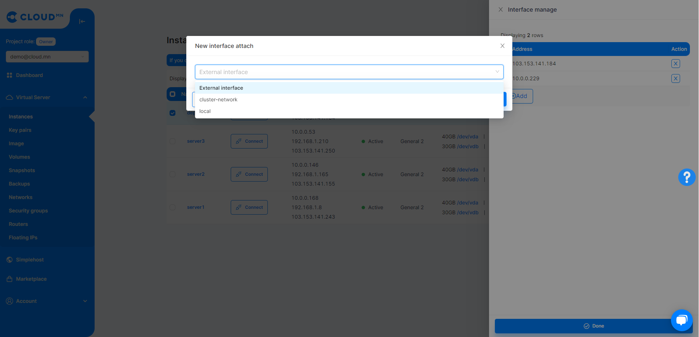

### Connecting a Floating IP address to the server (Associate Floating IP)

A fixed address or floating ip refers to an IP address that remains with you even when the server is destroyed, compared to a normal IP. Floating IP is reserved and used to connect to the desired server. For example: It is the most useful option when the user whitelists his IP. For a server with a simple address, the server is changed and selected randomly if it is deleted.

:::caution 
Floating IP addresses can only be added to Private networks.
:::

<ol>
  <li>Go to the <b>Instances</b> section of the <b>Virtual Server</b> menu.</li>
  <li>Click the <b>Server Actions</b> button to add a floating IP address.</li>
  <li>Click the <b>Actions</b> button to bring up the Dropdown menu and click the <b>Floating Manage</b> button. This will bring up a new dialog box.</li>
  <li>Select the floating IP address to be assigned from the Fixed address association field and click the <b>Associate</b> button.</li>
</ol>

  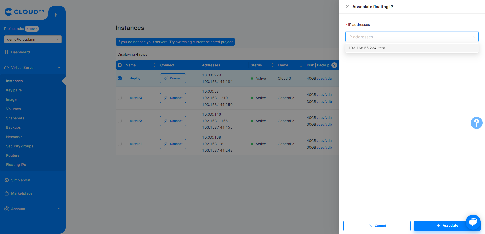

### Disk management (Volume manage) 

<ol>
  <li>Go to the <b>Instances</b> section of the <b>Virtual Server</b> menu.</li>
  <li>Click the Actions button.</li>
  <li>Click the Actions button to bring up a drop-down menu and click the <b>Volume manage</b> button. This will bring up a new dialog box.</li>
  <li>In the disk management area, disks that are not connected to another server will appear, click the button to select the disk to add.</li>
  <li>But clicking the eject button will remove the disk from that server</li>
</ol>

  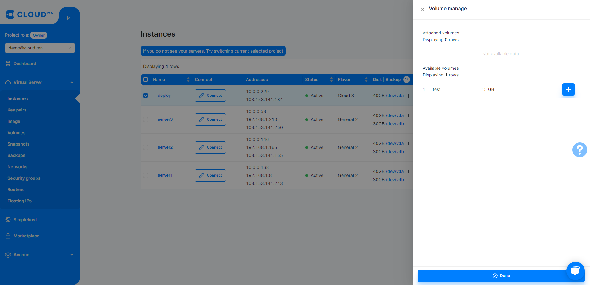

### Manage port settings (Security group manage)

<ol>
  <li>Go to the <b>Instances</b> section of the <b>Virtual Server</b> menu.</li>
  <li>Click the Actions button.</li>
  <li>Click the Actions button to bring up a drop-down menu and click the <b>Security Group manage</b> button. This will bring up a new dialog box.</li>
  <li>The field displays the attached and detached port settings</li>
  <li>Click the <b>Minus Sign</b> to remove that setting from the server.</li>
  <li>Click the <b>Plus Sign</b> to associate that setting with the server.</li>
  <li>Click on the configuration button to manage the ports for that configuration.</li>
</ol>

  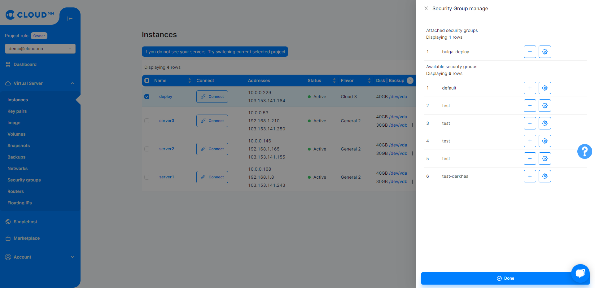
