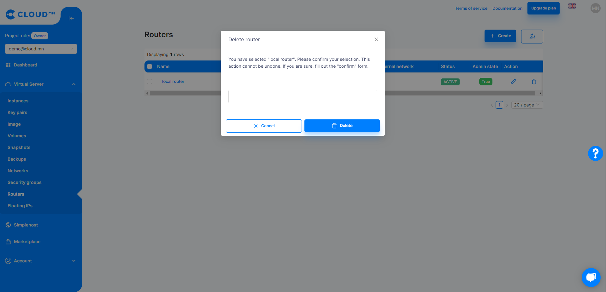

# Network

## Network

You can create and manage Private networks from the Network menu.

  

### Create a Private Network

<ol>
    <li>Click the <b>Create</b> Network button</li>
    <li>A new dialog box for creating a Private Network will appear, and in the <b>Name</b> field, enter the name of the network to be created</li>
    <li>Click the <b>Create</b> button to create a Private network. Instances located in a private network can communicate with each other through local network addresses. However, see the <a href='./floating'>Floating IP</a> section for more information about making it a Public IP.</li>
</ol>

  

When Private Network is created, it is created empty without any **Subnet**, and Instance cannot be started without Subnet.

### Create a Private Network Subnet

<ol>
    <li>Click on the Private Network text.</li>
</ol>

  

<ol start='2'>
    <li>Select the <b>Subnets</b> tab.</li>
</ol>

  

<ol start='3'>
    <li>Click the <b>Create Subnet</b> button.</li>
    <li>The following fields are required to create a new <b>Subnet</b>.</li>
    <ol>
        <li><b>Subnet Name</b> - The name of the Subnet</li>
        <li><b>Network address</b> - Specifies which IP address pool the Subnet will have. Network prefix or Mask must be specified. For example: 192.168.1.0/24</li>
        <li><b>Gateway IP</b> - Set the Gateway IP of the Subnet. For example: 192.168.1.1</li>
    </ol>
    <li>Enter the above fields and click the <b>Create button</b>.</li>
</ol>

  

### Delete Private Network

<ol>
    <li>Select Network from the Network table and delete it with the <b>Delete</b> button.</li>
</ol>

:::caution Warning
To delete the network, you must delete all the subnets and ports in use.
:::

  

### Auto Assign Ip vs Private network

During instance creation, the Network field is selected, and this field is set to Auto Assign IP by default. When Auto Assign IP is selected, the Instance is initially created with a Public IP address and will not connect to any Private network. However, in the case of creating an Instance in a Private network, you can disable Auto Assign IP in the Network field and select a Private network to create the Instance in that network. Instances located in a private network can communicate with each other through local network addresses. However, see the Floating IP section for more information about making it a Public IP.

## Router

Router provides Virtual layer 3 services such as Routing and NAT.

  

### Create a Router

<ol>
    <li>Enter the <b>Router</b> menu from the <b>Virtual Server</b> menu.</li>
    <li>A new dialog box will appear when you click the <b>Create</b> Routers button.</li>
    <li>A window with fields in the dialog appears.</li>
    <ol>
        <li><b>Name</b> - The name of Router(Required).</li>
        <li><b>Description</b> - Description of the router.</li>
        <li><b>External Network</b> - Must be enabled when an external network is configured.</li>
        <li><b>Admin state up</b> - Whether to turn on the Router with admin rights.</li>
    </ol>
    <li>After entering the fields, click the <b>Create</b> button in the lower right corner of the dialog.</li>
</ol>

  

### Delete the Router

<ol>
    <li>Enter the <b>Router</b> menu from the <b>Virtual Server</b> menu.</li>
    <li>Click on the text of the router you want to delete to enter the detailed information window.</li>
    <li>Go to Interface tab.</li>
    <li>Remove all interfaces from the list.</li>
    <li>Press the <b>Delete</b> button of the Router to be deleted.</li>
    <li>Click the <b>Delete</b> Router button in the lower right corner of the dialog that appears.</li>
</ol>

  

### Add an Interface to the Router

<ol>
    <li>Enter the <b>Router</b> menu from the <b>Virtual Server</b> menu.</li>
    <li>Click on Add Interface Router text from the table to enter the details window.</li>
    <li>Enter the Interfaces tab.</li>
</ol>

  

<ol start='4'>
    <li>Clicking the Add Interfaces button will bring up a new dialog box.</li>
    <li>In the Subnet field, select the subnet to add as Interface.</li>
    <li>Click the <b>Create button</b> in the lower right corner to add an interface.</li>
</ol>

  
