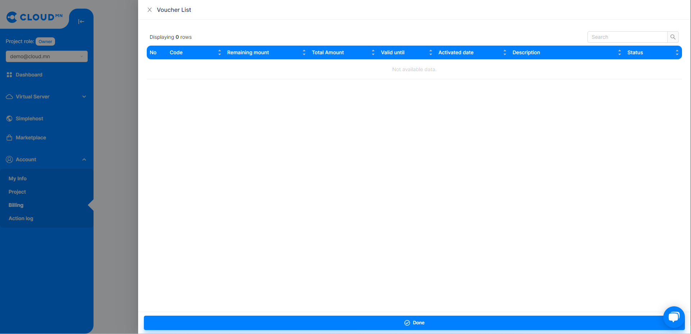

# Payment

  

### Payment Information

<ol>
    <li>Your payment information will appear in the <b>Billing section</b> of the "Account" menu.</li>
    <li>In the <b>Billing Information</b> field, the price of the server you are currently using will be displayed.</li>
    <li>The <b>Total Vouchers</b> field displays the total voucher information on your account.</li>
    <li>The <b>Voucher</b> field is where you enter your discount code.</li>
    <li>In the <b>Usage History</b> field, you can see the details of your usages such as Volume, Instance, IP, name, size, start date and end date.</li>
    <li>A summary of the amount you owe will appear in the <b>Invoice</b> field.</li>
    <li>A summary of your previous months' payments will appear in the <b>Billing History</b> field.</li>
</ol>

  
  

### To Pay

<ol>
    <li>Click on the <b>Pay</b> button in the <b>Invoice</b> field to view your invoice details.</li>
    <li>Click the <b>Download Invoice</b> button and your invoice will be displayed in .pdf format and available for download.</li>
    <li>By clicking the <b>Pay</b> button, the <b>Terms of payment</b> and <b>eBarimt type</b> sections will appear, and you can choose the payment method that suits you.</li>
</ol>

  

### Payment Reminder

<ol>
    <li>Go to the <b>Dashboard</b> menu</li>
    <li>Click the <b>Billing Alarm</b> button in the <b>Current Bill</b> field section.</li>
    <li>In the dialog box that appears, enter the maximum amount you want to pay in the <b>Amount</b> section and the field in the Details section and click the <b>Create</b> button.</li>
</ol>

:::note 
A reminder email will be sent to your registered email address if your usage exceeds the amount you entered.
:::

  

### Voucher

<ol>
    <li>Go to the <b>Billing</b> menu from the <b>Account</b> menu</li>
    <li>Click the <b>List</b> button on the <b>Voucher</b> field to display the details of your activated voucher code.</li>
</ol>

  

## How are fees calculated?

As a user, log in to <a href='https://cloud.mn'>cloud.mn</a> system and click on the **Calculator** Icon  in the upper right corner to enter the payment system. You can enter the resources you want to use and calculate how much the monthly payment will be.

  

Cloud.mn operates on a Pay-As-You-Go model. In other words, you won't be charged when your virtual server is turned off. In this way, there are no more time and money-consuming things, such as preliminary high costs or contracts.

### Charges for vRam and vCpu

For vRam and vCpu, billing is based on hours worked and not if you shut down the Instance.

| vCPU(Count) | Monthly Fee(₮) |
| ------- | --------------- |
|    1    |      12'000     |

| vRAM(GB) | Monthly Fee(₮) |
| ------- | --------------- |
|    1    |      12'000     |

### Fee for Snapshot, Backup and Volume

For Snapshot, Backup and Volume, the monthly fee is calculated based on the amount used.

<table>
  <tr>
    <th>Type</th>
    <th>Volume(1 GB)</th>
    <th>Monthly Fee(₮)</th>
  </tr>
  <tr>
    <td rowspan="2">Virtual disk</td>
    <td>HDD</td>
    <td>300</td>
  </tr>
  <tr>
    <td>SSD</td>
    <td>800</td>
  </tr>
  <tr>
    <td>Snapshot</td>  
    <td>-</td>
    <td>200</td>      
  </tr>
  <tr>
    <td>Backup</td>  
    <td>-</td>
    <td>300</td>      
  </tr>  
</table>

### Public IP address

| IP(Count) | Monthly Fee(₮) |
| ---- | ------------------ |
|  1   |       5'000        |
|  Additional IP   |       30'000       |

### Router

| IP(Count) | Monthly Fee(₮) |
| ---- | ------------------ |
|  1   |       30'000        |
