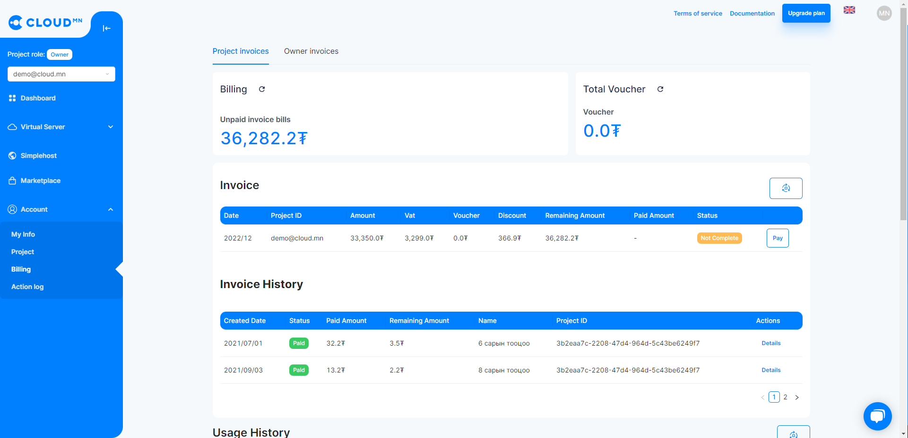

# Payment

  

### Төлбөрийн мэдээлэл

<ol>
    <li><b>Миний хэсэг</b> цэсээс <b>Төлбөр</b> цэс рүү орох үед таны төлбөрийн мэдээлэл гарч ирнэ.</li>
    <li><b>Төлбөрийн мэдээлэл</b> талбар дээр таны одоогийн хэрэглэж буй серверийн үнийн мэдээлэл гарч ирнэ.</li>
    <li><b>Нийт ваучер</b> талбар дээр таны бүртгэл дээр байгаа нийт ваучерын мэдээлэл гарч ирнэ.</li>
    <li><b>Ваучер</b> талбар нь хөнгөлөлтийн кодоо оруулах хэсэг юм.</li>
    <li><b>Хэрэглээний түүх</b> талбар дээр таны хэрэглэж буй Сервер, Диск, IP хаяг зэрэг хэрэглээнүүдийн дэлгэрэнгүй мэдээлэл, нэр, хэмжээ, эхэлсэн огноо дууссан огноо мэдээллүүд харагдана.</li>
    <li><b>Нэхэмжлэл</b> талбар дээр таны төлөх ёстой үнийн дүнгийн хураангуй мэдээлэл гарч ирнэ.</li>
    <li><b>Нэхэмжлэлийн түүх</b> талбар дээр таны өмнөх саруудын төлсөн төлбөрийн хураангуй мэдээлэл гарч ирнэ.</li>
</ol>

  
  

### Төлбөр төлөх

<ol>
    <li><b>Нэхэмжлэл</b> талбар дээрх <b>Төлбөр төлөх</b> товчийг дарснаар таны нэхэмжлэлийн дэлгэрэнгүй мэдээлэл гарна.</li>
    <li><b>Нэхэмжлэл татах</b> товчийг дарж нэхэмжлэлийг .pdf хэлбэрээр татаж авах боломжтой.</li>
    <li><b>Төлбөр төлөх</b> товчийг дарснаар <b>Төлбөрийн нөхцөл</b> болон <b>eBarimt төрөл</b> гэсэн хэсгүүд гарч ирэх бөгөөд өөрт тохирох хэлбэрийг сонгон төлбөрөө төлнө.</li>
</ol>

  

### Төлбөрийн сануулга

<ol>
    <li><b>Хяналтын самбар</b> цэс рүү орох.</li>
    <li>Одоогийн төлбөр талбар хэсгээс <b>Төлбөрийн сануулга</b> товч дээр дарна.</li>
    <li>Гарч ирэх диалог цонх дээр Дүн хэсэгт өөрийн төлөх ёстой үнийн дүнгийн дээд хэмжээ болон Дэлгэрэнгүй хэсэгт талбарыг хамт бичиж <b>Үүсгэх</b> товчийг дарж үүсгэнэ.</li>
</ol>

:::note мэдээлэл
Таны бичиж өгсөн үнийн дүнгээс хэрэглээ тань давсан тохиолдолд таны бүртгэлтэй э-мэйл хаяг руу сануулга мэйл очих болно.
:::

  

### Ваучер

<ol>
    <li><b>Миний хэсэг</b> цэсээс <b>Төлбөр</b> цэс рүү орох</li>
    <li><b>Ваучер</b> талбар дээрх <b>Жагсаалт</b> товчийг дарснаар таны идэвхжүүлсэн ваучер кодын дэлгэрэнгүй мэдээлэл гарч ирнэ.</li>
</ol>

  

## Төлбөр хэрхэн бодогддог вэ?

Хэрэглэгч та <a href='https://cloud.mn'>cloud.mn</a> веб хуудасны **Төлбөр** цэс рүү хандаж төлбөр бодох хэсэг рүү орно. Үүнд өөрийн хэрэглэхийг хүссэн хэмжээг оруулж сарын төлбөр хэд гарах тухай барагцаалах боломжтой.

  

Cloud.mn нь Pay-As-You-Go буюу хэрэглэснээрээ төлбөр төлөх загвараар ажилладаг. Өөрөөр хэлбэл та өөрийн виртуал серверийг унтраасан үед төлбөр бодогдохгүй гэсэн үг юм. Ингэснээр хэрэглэгчдээс урьдчилсан байдлаар их зардал гарах эсвэл гэрээ хэлцэл хийх гэх мэт хугацаа, санхүүгийн зарцуулагдах зүйлс байхгүй болж байна гэсэн үг юм.

### vCPU болон vRAM-ний төлбөрийн хувьд

vCPU болон vRAM-ний төлбөрийн хувьд ажилласан цагаар бодогддог ба та тухайн серверийг унтраасан тохиолдолд төлбөр бодогдохгүй.

| vCPU(Ширхэг) | Сарын төлбөр(₮) |
| ------- | --------------- |
|    1    |      12'000     |

| vRAM(GB) | Сарын төлбөр(₮) |
| ------- | --------------- |
|    1    |      12'000     |

### Snapshot болон Дискний төлбөрийн хувьд

Snapshot болон дискний хувьд ашиглаж буй хэмжээнээсээ хамаарч сарын төлбөр нь бодогдоно.

Дискний хувьд үнэ бодох хүснэгт

| Диск(GB) | Сарын төлбөр(₮) |
| -------- | --------------- |
|  1 HDD   |       300       |
|  1 SSD   |       800       |

Snapshot-н хувьд үнэ бодох хүснэгт

| Диск(GB) | Сарын төлбөр(₮) |
| ------- | --------------- |
|    1    |      150     |

### Public IP хаяг

| IP(Ширхэг) | Сарын төлбөр(₮) |
| ---- | ------------------ |
|  1   |       5'000        |
|  Нэмэлт хаяг   |       30'000       |

### Чиглүүлэгч

| IP(Ширхэг) | Сарын төлбөр(₮) |
| ---- | ------------------ |
|  1   |       20'000        |