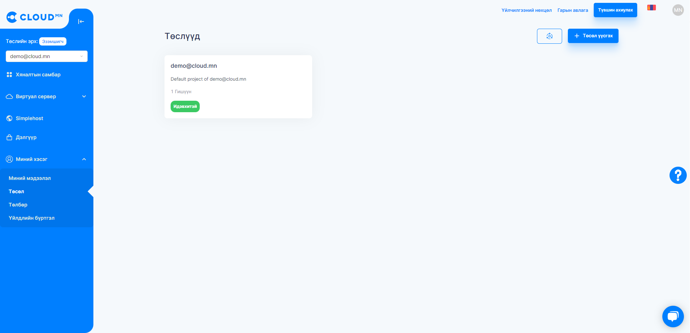
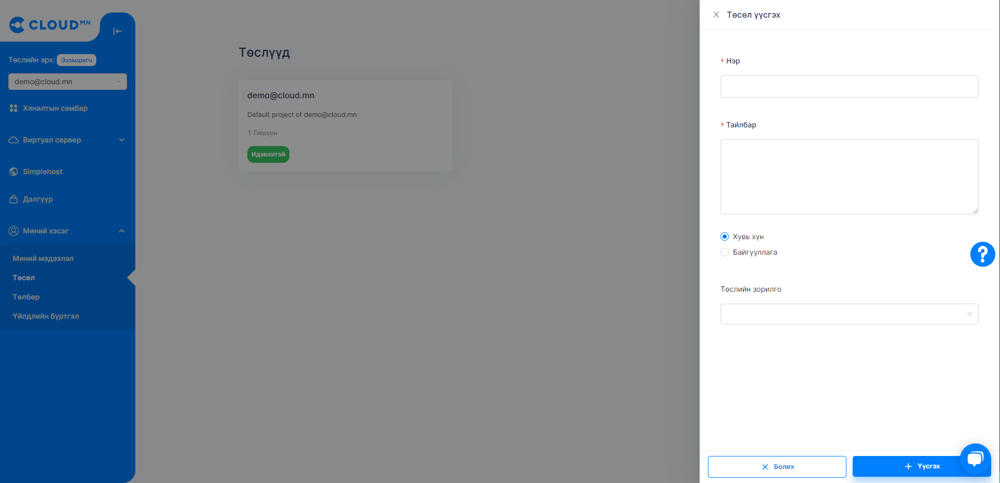
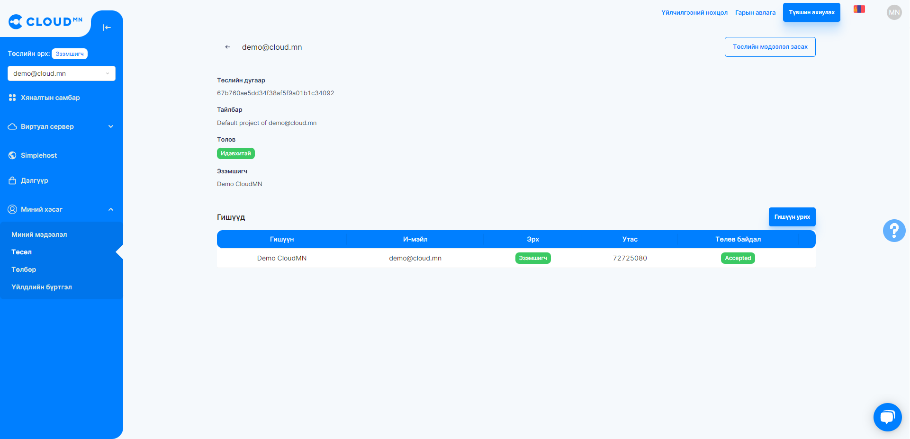
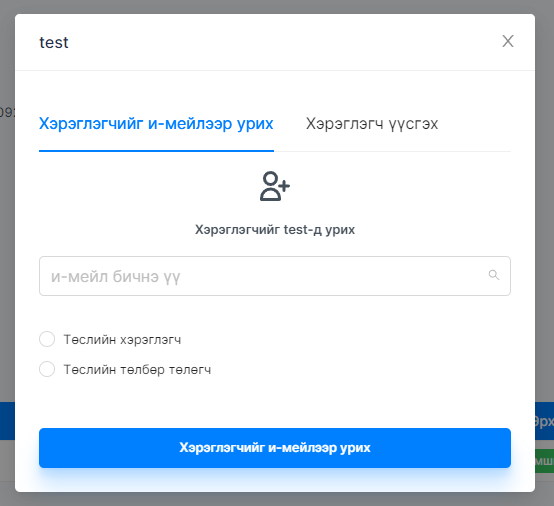
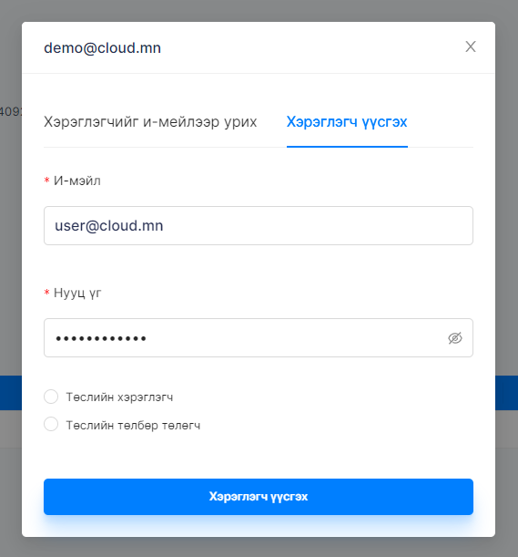
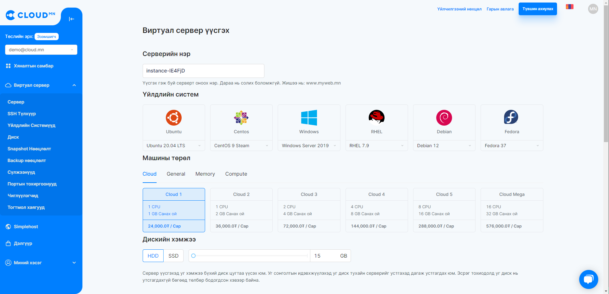
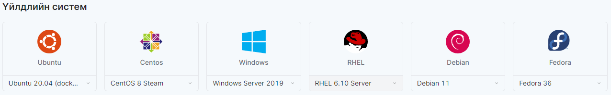
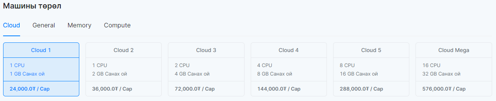
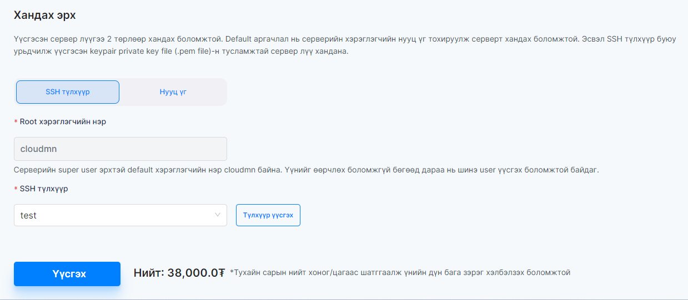

# Project

## Төсөл гэж юу вэ?

Төсөл гэдэг нь өөрийн ашиглаж байгаа серверийн болон санхүүгийн удирдлагын хэсгийг бусадтай хувааж ашиглахыг хэлнэ. Төсөл нь дотроо сервер, SSH түлхүүр, үйлдлийн системүүд, диск, snapshot, нөөцлөлт, сүлжээнүүд, портын тохиргоонууд, чиглүүлэгчид, тогтмол хаягууд гэх зүйлүүдийг агуулдаг ба бусад хүмүүс (хөгжүүлэгчдэд) энэ нөөц рүү хандах эрхийг олгож байгаа юм. Мөн санхүүгийн буюу төлбөр төлөх ажилтны мэдээллийг холбож төлбөрийг мэдээллийг илгээх, харах боломжтой.

Та сервер үүсгэхдээ шинэ төсөл үүсгэж тус төсөл дээр серверээ үүсгэснээр тус бүрийн төсөл дээр дараах эрхүүдээс нэмэх боломжтой болно. Төслийн эрхүүд:

- **Эзэмшигч - төслийг анх үүсгэсэн хүн**
- **Төлбөр төлөгч - төслийн төлбөр төлөх хүн**
- **Хэрэглэгч - төслийн хөгжүүлэгч, хэрэглэгч** гэсэн гурван төрлийн эрх байна.

Төсөл үүсгэх зорилго нь серверийн удирдлагад оролцож буй хүмүүсийн үүргийг ялгахад оршино.

Жишээ нь: Хэрвээ та үйлчилгээний төлбөр төлөгч биш бол төлбөр төлж байгаа гишүүнийг урьснаар нэхэмжлэх зөвхөн төлбөр төлөгчийн э-мэйл хаяг руу очих боломжтой. Өөрөөр хэлбэл өөр эзэмшигчийн олон тооны сервер танд бүртгэлтэй байгаа бол сервер тус бүрийн төлбөр тухайн төслийн төлбөр төлөгч бүрд очиж эзэмшигчид илүү хялбар байдлыг бий болгож байгаа юм.

:::info
Cloud.mn дээр бүртгэл үүсгэсэн хүн бүрт нэг төсөл автоматаар үүснэ.
:::

## Төсөл хэрхэн үүсгэх вэ?

### Төсөл үүсгэх

1. **Миний хэсэг** цэсээс **Төсөл** цэс рүү орох. 

2. **Төсөл үүсгэх** товч дээр дарж төслийн нэр, тайлбар, төслийн зорилго мэдээллүүдийг оруулж **Үүсгэх** товчийг дарна.

### Төслийн хяналтын самбар

Үүсгэсэн төсөл дээр дарж орсноор төслийн талаарх дэлгэрэнгүй мэдээлэл болон төсөлд оролцох эрхтэй бусад гишүүдийн мэдээлэл гарч ирнэ.

:::tip
Төслийн гишүүнийг **хэрэглэгчийг э-мэйлээр урих** эсвэл **хэрэглэгч үүсгэж урих** гэсэн хоёр аргаар урих боломжтой. 
:::

**Гишүүн урих** товчийг дарснаар урих хүний э-мэйл хаягийг бичих талбар болон түүний үүргийг сонгож **Урих** товчийг дарна. Урьж буй хэрэглэгч нь заавал <a href='https://cloud.mn'>cloud.mn</a> дээр бүртгүүлсэн байх шаардлагатай бөгөөд урилгыг хүлээн авснаар төслийн эрх идэвхэжнэ. 

Харин хэрэглэгч үүсгэж урихдаа урих хүний нэвтрэх э-мэйл хаяг, нууц үг болон түүний төслийн үүргийг сонгож **Урих** товчийг дарна.

## Шинээр үүсгэсэн төсөл дээрээ хэрхэн сервер үүсгэх вэ?

Одоогийн байгаа төслөө шинээр үүсгэсэн төслөөрөө солино.

1. **Виртуал сервер** цэсээс **Сервер** цэс рүү орно. Сервер шинээр үүсгэхдээ **Үүсгэх** товчийг дарна. 

2. Гарч ирэх шинэ цонхонд тухайн сервертэй холбоотой мэдээлэл болон үзүүлэлтүүдийг сонгох шаардлагатай. Эхлээд **Үйлдлийн систем**-ийг сонгоно. 
:::info 
Хэрвээ та Windows сервер үүсгэхийг хүсэж байгаа бол info@cloud.mn-рүү хүсэлт гаргах шаардлагатай.
:::

3. Үйлдлийн систем сонгосны дараа **Машины төрөл** буюу vCPU, vRAM сонгоно. Машины төрөл нь үндсэн 4 хэсэгт хуваагддаг.

- **Cloud** - Энгийн хэрэглэгчдэд зориулсан сонголт бөгөөд энгийн хэрэглээ, блог, статик веб, тестийн орчин, санах  ойн cache хадгалалт, жижиг систем, энгийн database ажиллуулахад тохиромжтой серверийн төрөл юм.
- **General** - Онлайн худалдаа, мэдээний сайт гэх мэт илүү өндөр ачаалал авдаг, найдвартай ажиллагаа шаардсан системүүд ажиллуулахад тохиромжтой серверийн төрөл юм.
- **Memory** - Илүү хурд болон ачаалал даах төрөл. Өндөр ачаалал бүхий өгөгдлийн сангийн систем, их хэмжээний ачаалал авдаг санах ой их шаардагддаг систем ажиллуулахад тохиромжтой серверийн төрөл юм.
- **Compute** - Илүү тооцоолон бодох төрөлд багтдаг, CI/CD application build хийх, видео зурагтай холбоотой процесс хийх, машин сургалт гэх мэт тооцоолон бодох функц ихтэй программ ажиллуулах тохиромжтой серверийн төрөл юм.

4. Бусад мэдээлэл

- **Серверийн нэр** буюу виртуал серверийн нэрийг өгнө.
- **Хандах эрх** талбарт оруулсан хэрэглэгчийн нэр, нууц үгийг ашиглаж серверлүүгээ SSH хандалт хийх боломжтой. Мөн хэрэглэгчийн үүсгэсэн SSH түлхүүрийн тусламжтай серверлүүгээ хандаж болдог. Серверлүүгээ нэвтрэх талаар <a href="/userguide/connect-to-instance">Сервертэй холбогдох</a> хэсгээс уншина уу.
- **Дискийн хэмжээ** дээр тухай серверт хэрэглэгдэх виртуал дискний хэмжээг оруулна.
- **Сүлжээ** дээр хэрэглэгч Private сүлжээний IP хаяг ашиглах боломжтой. Эсвэл **Автоматаар IP оноох** сонголтыг идэвхжүүлснээр cloud.mn тухайн үүсгэж буй серверт Public IP хаяг оноож өгөх болно. Тохиргооны тухай дэлгэрэнгүй <a href="/userguide/network#автоматаар-ip-оноох-болон-private-сүлжээний-харьцуулалт">Автоматаар-ip-оноох-болон-private-сүлжээний-харьцуулалт</a> хэсгээс уншина уу.
- **Портын тохиргоо** дээр хэрэглэгч өөрийн портын тохиргоог сонгоно. Энэ нь тухайн сервер хэрэглэгчийн сонгосон портын тохиргоо дээр бичигдсэн дүрмүүдийг мөрдөнө. Портын тохиргооны тухайн дэлгэрэнгүйг <a href="/userguide/security">Портын тохиргоонууд</a> хэсгээс уншина уу.
- Бүх тохиргоог сонгосны дараа тухайн сервер тасралтгүй ажиллахад сард гарах мөнгөн дүнг бодож харуулна.

Бүх тохиргоо болон үнийн дүнг нягталж үзсэний дараа **Үүсгэх** товчийг дарснаар таны виртуал сервер үүснэ.

