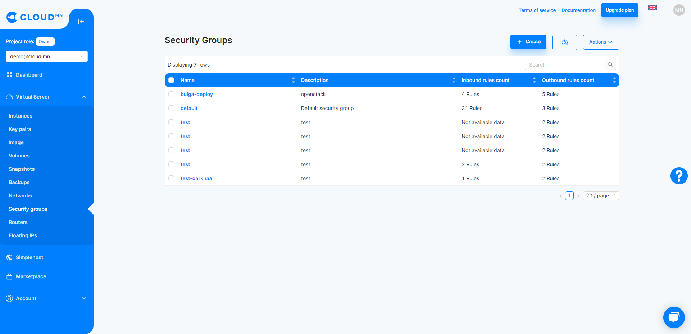
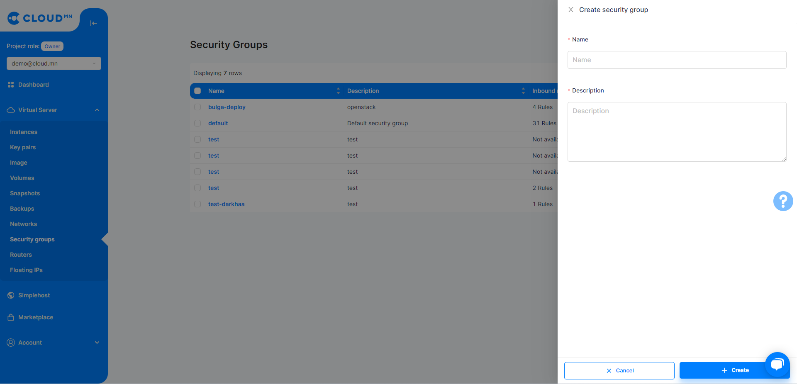
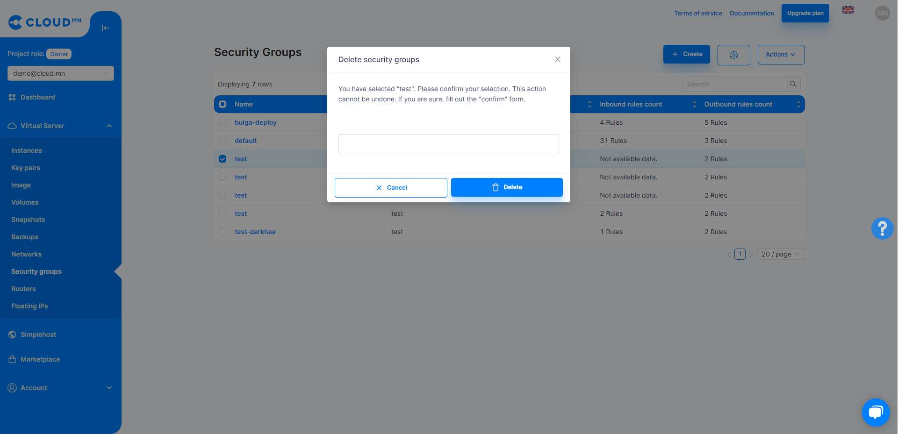
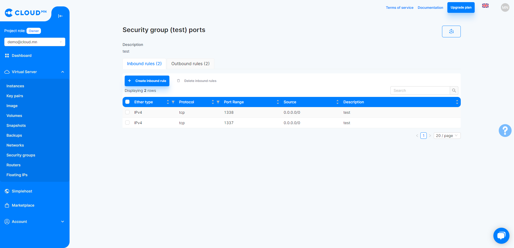
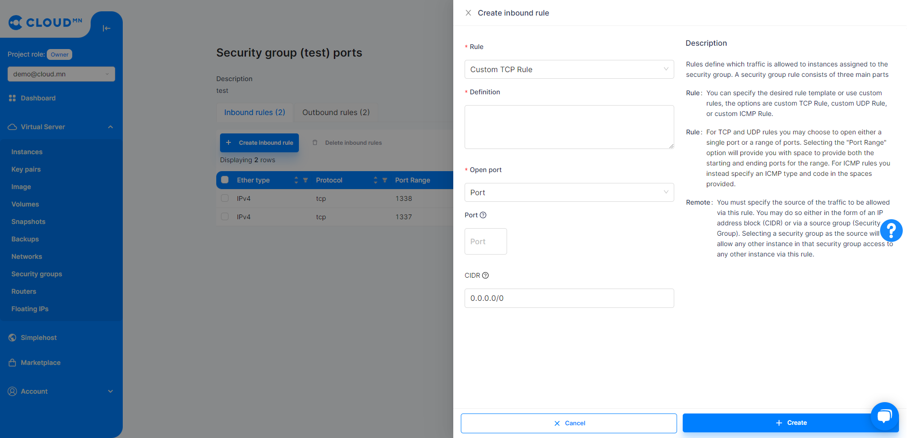
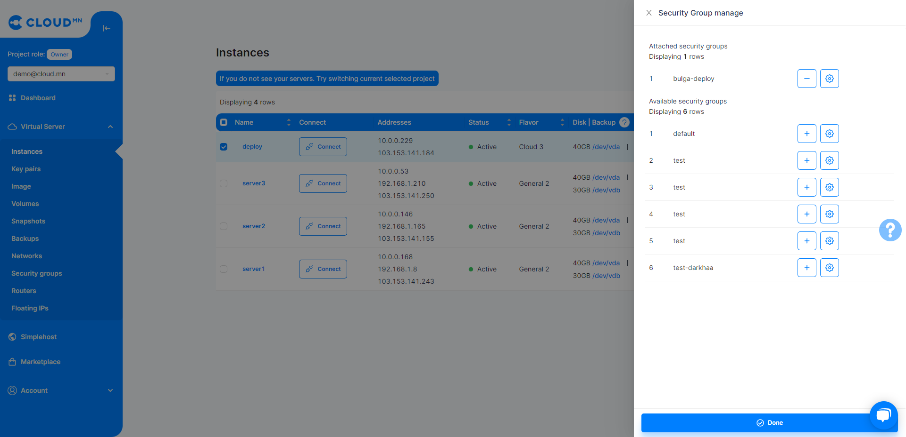

# Port Configuration (Security Group)

## Security Groups
A Security Group is a collection of Virtual Firewalls designed to control ingress (Inbound for an Instance) and outgress (Outbound for an Instance) network traffic at the port level. Virtual Firewall consists of Rules to open/close that port traffic. For example: You can make a rule to allow access to instance port 8080 from all hosts in the world or from hosts with a certain number of IP addresses.

  

### Create a Security Group

<ol>
    <li>Enter the Security Groups menu from the Network menu.</li>
    <li>When you click on the Create Security Group button, a new dialog box will appear.</li>
    <li>Enter the Name and Description fields and click the Create button to create a new Security group.</li>
</ol>

  

### Delete Security Group

<ol>
    <li>Enter the Security Groups menu from the Virtual server menu..</li>
    <li>Select the Security Groups to remove from the table.</li>
    <li>Selecting a Security Group activates the Delete Security Groups button above the table.</li>
    <li>Press the corresponding button and type Confirm in the entry field to confirm the deletion.</li>
    <li>Click the Delete Security Groups button in the lower right corner of the dialog.</li>
</ol>

  

### Security Group Rule Management

Each rule consists of fields called Port, Description, Direction, and CIDR.

<ul>
    <li>Port - Application port. In addition to a single port, a port range or multiple ports can be entered.</li>
    <li>Description - Description of the Rule.</li>
    <li>Direction - There can be two types below.</li>
    <ul>
        <li>Inbound - Setting to open access to that port from the outside.</li>
        <li>Outbound - Setting to open access to the outside through the given port.</li>
    </ul>
    <li>CIDR - The range of IP addresses to which the rule applies.</li>
</ul>

  

#### Open SSH Port

<ol>
    <li>Select a Security Group from the Security Groups menu and click the Manage Rules button.</li>
    <li>Click the Add Rules button and a new dialog will appear.</li>
    <li>Select the SSH protocol from the Rule field.</li>
    <li>Write a description in the Description field.</li>
    <li>Select Inbound from the Direction field.</li>
    <li>Write the list of CIDR or IP addresses to be implemented.</li>
    <li>Click the Create button in the lower right corner of the dialog.</li>
</ol>

  

### Add a Security Group to the Instance.

<ol>
    <li>Select the <b>Instances</b> menu from the <b>Virtual Server</b> menu.</li>
  <li>Click on the text of the Instance you want to add <b>Security Group</b> to enter the detailed information window.</li>
    <li>Select the Security Group tab from the Details window.</li>
    <li>Click the Add Security Group button and a new dialog will appear.</li>
    <li>Select the Security Group you want to add from the Security Groups field.</li>
    <li>Click the <b>Done</b> button in the lower right corner of the dialog.</li>
</ol>

  
