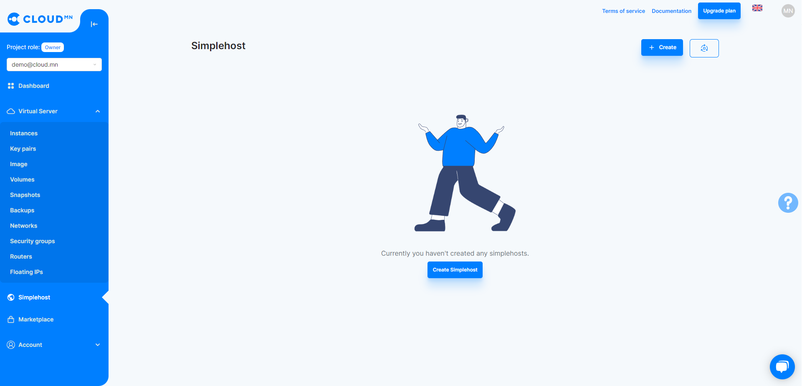
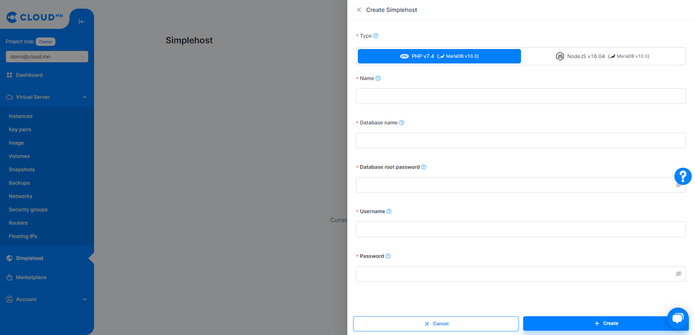
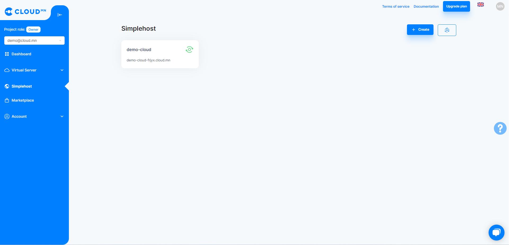
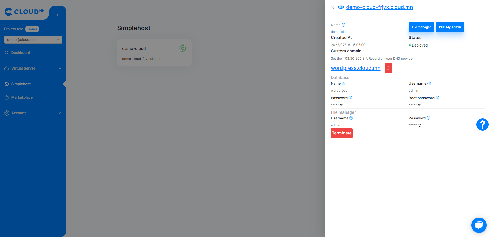

# Simplehost

Simplehost буюу Веб хост. Хялбарчлах үүднээс цаашид уг гарын авлагад "Simplehost" хэмээн нэрлэх болно.

## PHP суурьтай Simplehost үүсгэх

1. Хэрэглэгчийн console хэсгийн зүүн талд байрлах **Simplehost** цэс рүү орно.

2. **Simplehost** шинээр үүсгэхдээ **Үүсгэх** товчийг дарна. Гарч ирэх шинэ цонхноос PHP-г сонгож тухайн үүсгэх гэж буй хостын тохиргооны мэдээллийг оруулж **Үүсгэх** товчийг дарна.

3. **Simplehost** шинээр үүсгэсний дараа үр дүн дараах байдлаар харагдана.

4. Үүсгэсэн **Simplehost** дээр дарж домайн нэр бүхий веб холбоосоор хандаж орсны дараа үндсэн хуудас харагдах болно.

5. Үндсэн хуудасны filemanager товч дээр дарж веб холбоосоор үсэрсний дараа нэвтрэх хэсэгт **simplehost үүсгэхдээ оруулж өгсөн хэрэглэгчийн нэр, нууц үгийг** оруулна.

6. **Хуулах** товч дээр дарж хост хийх вебийн файлуудыг хуулж өгнө. Zip файл хуулсан бол задлах шаардлагатай.

7. Хуулж өгсөн хавтасны нэрийг simplehost-ын домайн нэрний араас бичиж веб холбоосоор хандана.

- Жишээ нь: **simplehost.cloud.mn/wordpress/**

8. Үндсэн хуудасны phpMyAdmin товч дээр дарж веб холбоосоор үсэрсний дараа **simplehost үүсгэхдээ оруулж өгсөн хэрэглэгчийн нэр, нууц үгийг** оруулна. Server талбарыг хоосон орхино.

9. Өгөгдлийн сантай холбогдохын тулд **phpMyAdmin-н серверийн холбоос**ыг ашиглана.

10. Wordpress вэб сайтын **админы тохиргоог** оруулна.

11. Wordpress вэб сайт руу **админ эрхээр хандаж** орно.

12. Wordpress вэб сайт руу админ эрхээр хандаж орсоны дараа үр дүн дараах байдлаар харагдана.

## Simplehost-г өөрийн домайн хаягтай холбох

1. Өөрийн домайн хаягаа simplehost-тай холбож ашиглахын тулд **домайнаа оруулж нэмэх** товчин дээр дарна.

2. Мөн тухайн домайны **A рекорд** үүсгэж өгнө.

3. Үр дүн дараах байдлаар харагдана.

