# Simplehost

Simplhost or web hosting to simplify the Documentation will be called "Simplehost".

## Create Simplehost

1. Left on the left hand side of Consumer Console **Simplehost** to menu.

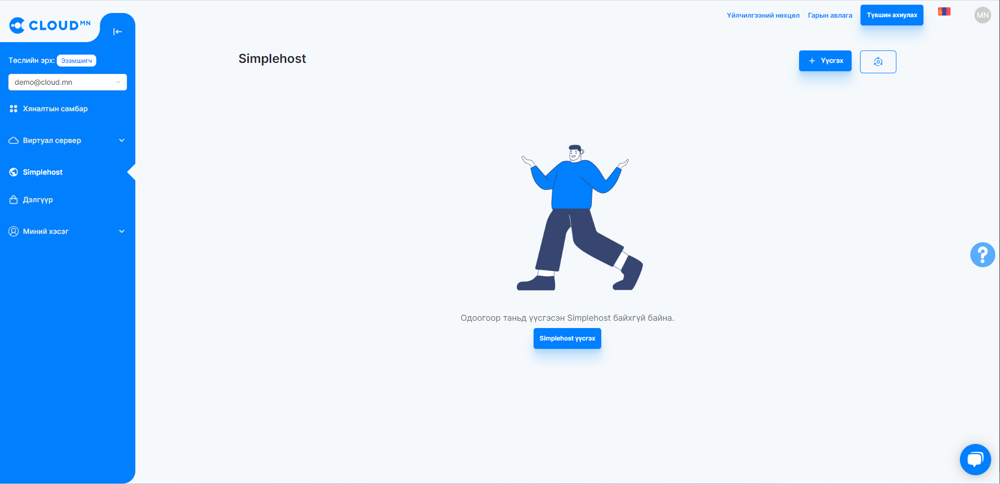

2. Click <b>Create</b> App button. Simplehost presents several configuration. You can configure the following options:
<ul>
    <li><b>Name</b> - Simplehost called name (be lowercase).</li>
    <li><b>Database</b> - Default mysql database name.</li>
    <li><b>Database root password</b> - Default mysql root password.</li>
    <li><b>Username</b> - Default file manager and database username.</li>
    <li><b>Password</b> - Default file manager and database password</li>
</ul>

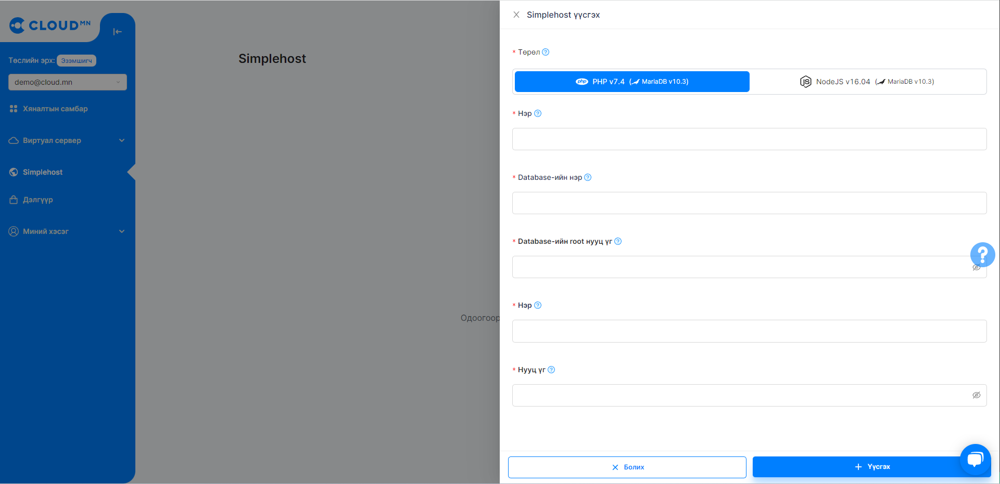

3. Once your **Simplehost** deploys, you can view at the URL at detail page.

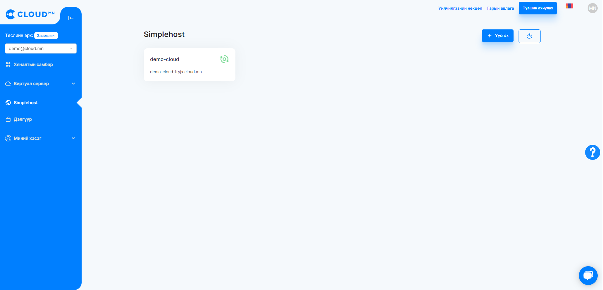

4. After clicking on the generated Simplehost to access the web link with the domain name, the main page will be displayed.

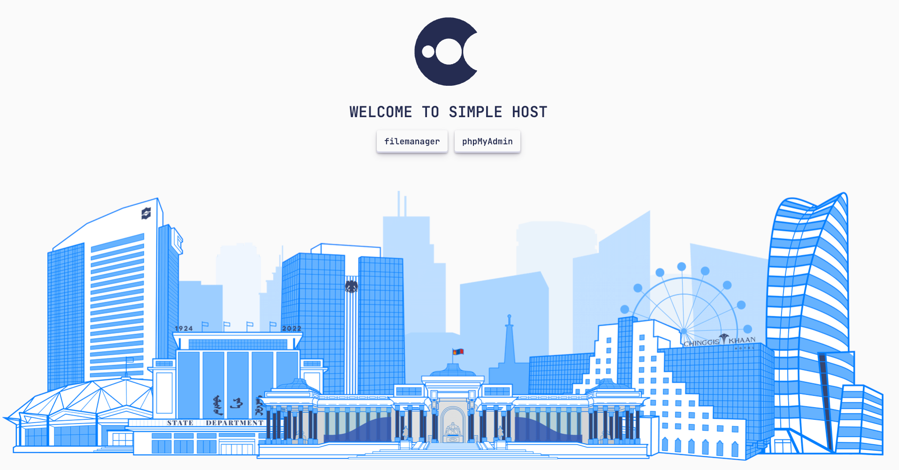

5. You can then access the **file manager and database using the username and password** you created.

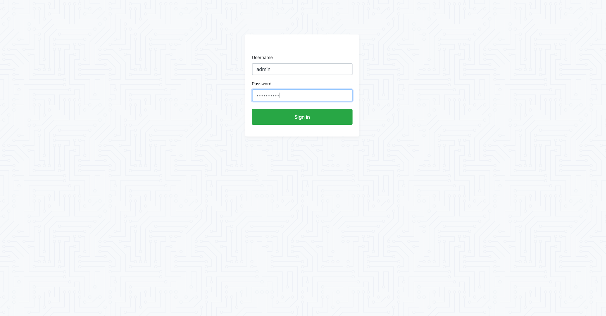

6. Click the **Copy** button to copy the web files to be hosted. If the zip file is copied, it needs to be unzipped..

7. Хуулж өгсөн хавтасны нэрийг simplehost-ын домайн нэрний араас бичиж веб холбоосоор хандана.

- Жишээ нь: **simplehost.cloud.mn/wordpress/**

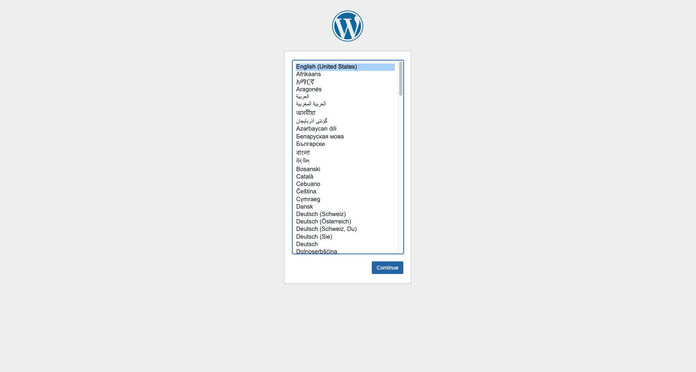

8. Үндсэн хуудасны phpMyAdmin товч дээр дарж веб холбоосоор үсэрсний дараа **simplehost үүсгэхдээ оруулж өгсөн хэрэглэгчийн нэр, нууц үгийг** оруулна. Server талбарыг хоосон орхино.

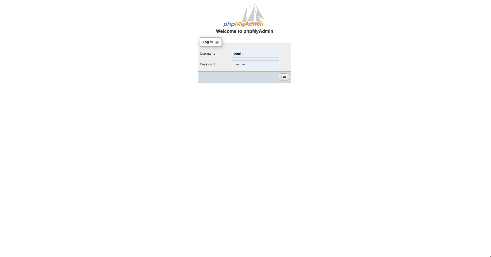

9. Өгөгдлийн сантай холбогдохын тулд **phpMyAdmin-н серверийн холбоос**ыг ашиглана.

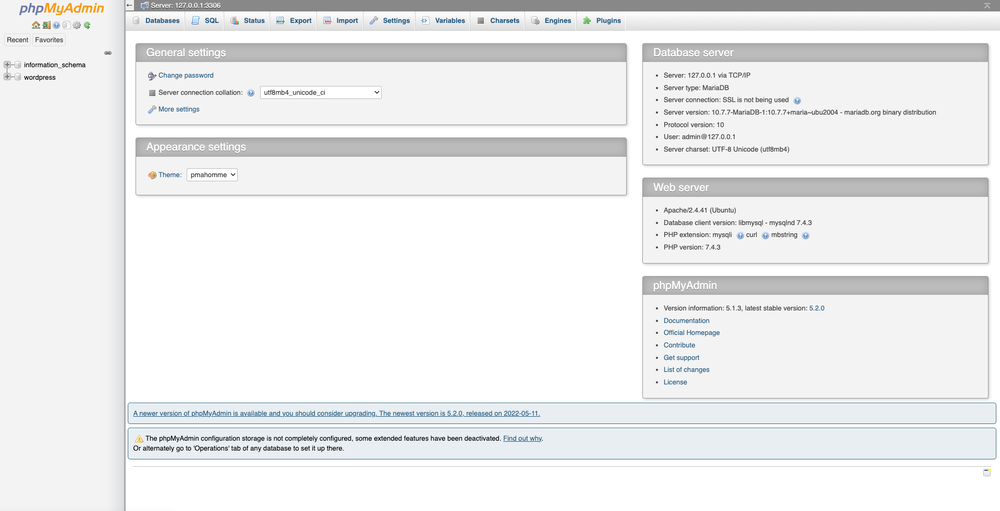

10. Wordpress вэб сайтын **админы тохиргоог** оруулна.

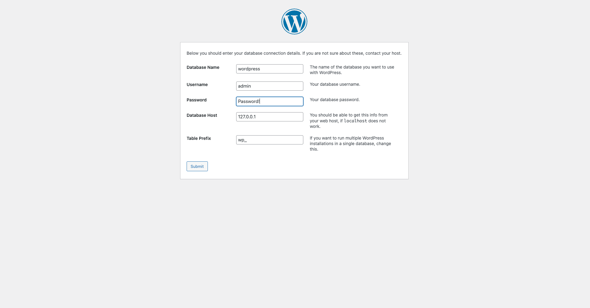

11. Wordpress вэб сайт руу **админ эрхээр хандаж** орно.

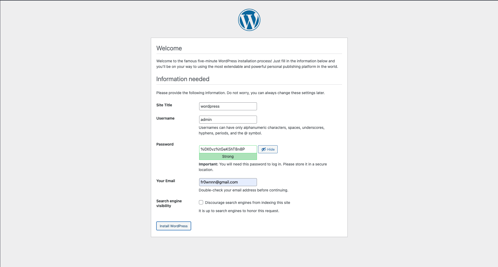

12. Wordpress вэб сайт руу админ эрхээр хандаж орсоны дараа үр дүн дараах байдлаар харагдана.

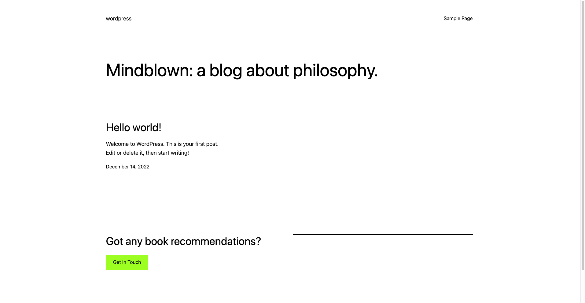

## Simplehost-г өөрийн домайн хаягтай холбох

1. Өөрийн домайн хаягаа simplehost-тай холбож ашиглахын тулд **домайнаа оруулж нэмэх** товчин дээр дарна.

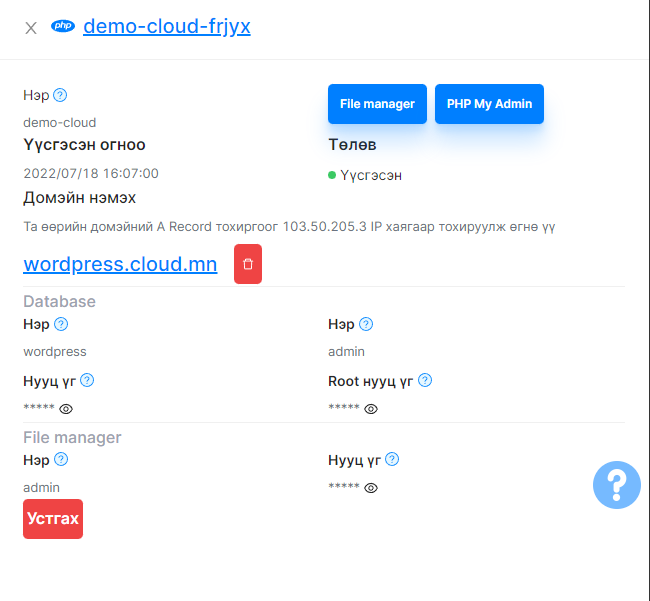

2. Мөн тухайн домайны **A рекорд** үүсгэж өгнө.

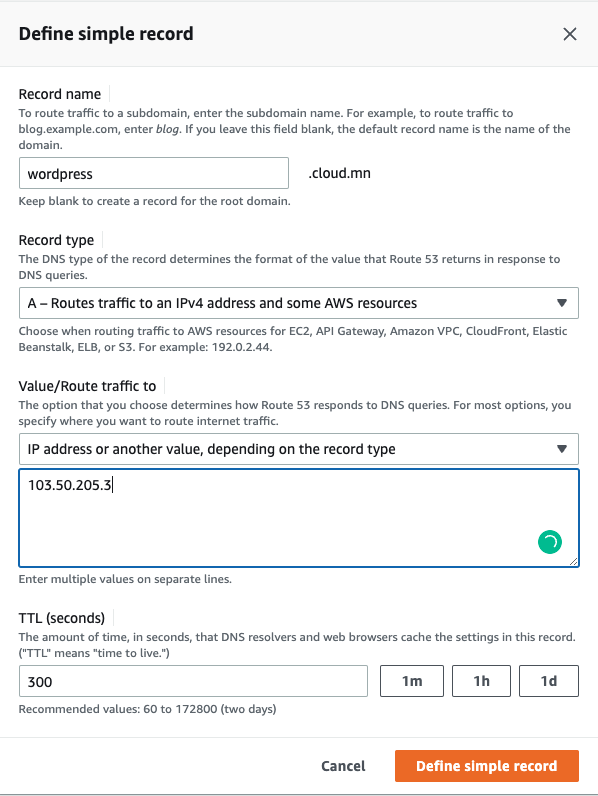

3. Үр дүн дараах байдлаар харагдана.

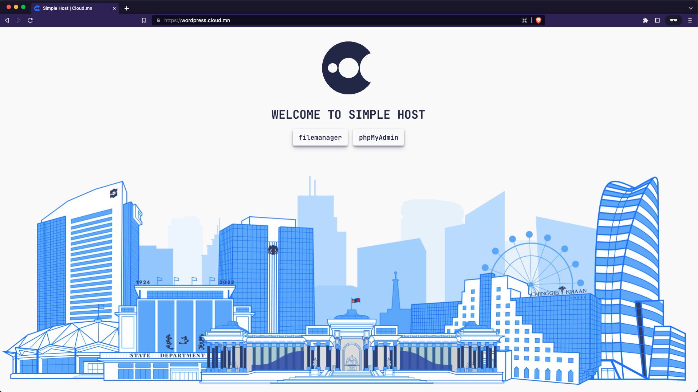
