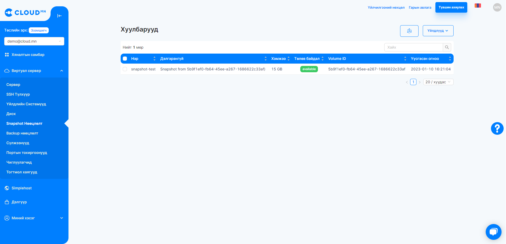
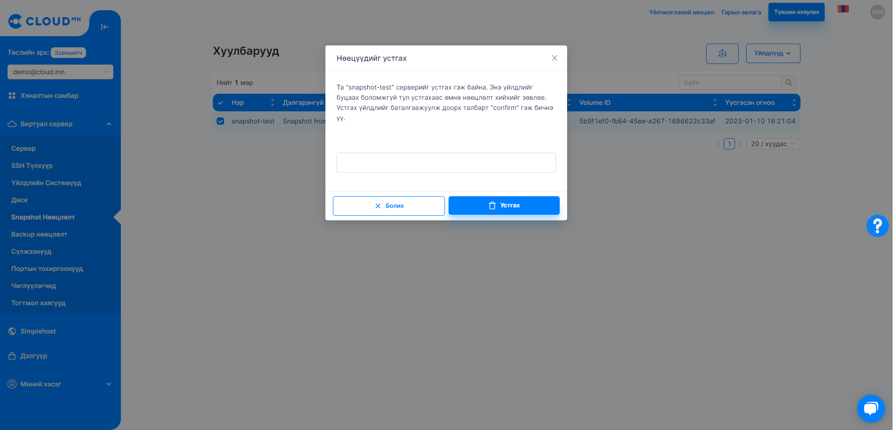

# Snapshots

Snapshot гэдэг серверийн өөрчлөлтийг хадгалахыг хэлдэг. Backup-ийн зориулалтаар ашиглаж болдог. Гэхдээ backup-с ялгаатай нь snapshot-н хэмжээний харьцангуй бага байдаг мөн дискэнд гарсан өөрчлөлтүүдийг л хадгалдаг юм.

## Snapshots үйлдлүүд

### Snapshot үүсгэх

:::note Заавар
Volume дотроос Snapshot үүсгэдэг. <a href='./volume#виртуал-дискийн-хуулбарыг-хадгалах-snapshot'>Үүсгэх заавар</a>.
:::

### Snapshot устгах

<ol>
    <li>Устгах гэж буй snapshot-н сонгож Үйлдэл хэсгээс Устгах товчийг дарна.</li>
</ol>

  

<ol start='2'>
    <li>Snapshot-г устгах дараах цонх нээгдэх ба Устгах товчийг дарснаар устах үйлдэл амжилттай болно.</li>
</ol>

  

### Snapshot-г Сервер байдлаар асаах

<ol>
    <li>Виртуал сервер цэсний Snapshot нөөцлөлт цэсрүү орох</li>
    <li>Асаахыг хүссэн Snapshot-г сонгож Сервер үүсгэх товчийг дарах</li>
    <li>Сервер үүсгэх товчийг дарснаар шинэ диалог цонх гарч ирэх ба дараах талбаруудыг бөглөнө.</li>
    <ul>
        <li>Серверийн нэр</li>
        <li>Серверийн машины төрөл</li>
        <li>Хандах эрх</li>
        <li>Дискийн хэмжээг зааж өгөх</li>
    </ul>
    <li>Диалогын баруун доод буландах Үүсгэх товчийг дарах.</li>
</ol>

:::tip Зөвлөгөө
Үүсгэсэн серверээ Вирутал сервер цэсний **Сервер** цэсрүү орж харах боломжтой.
:::

  

### Snapshot дээр төлбөр бодогдох уу?

Хэрэглэгч гараас snapshot авсан тохиолдолд мөнгө тооцдоггүй харин эрсдэлээс сэргийлсэн өдөр болгон автоматаар snapshot авах үйлдэл нь төлбөртэй юм.
