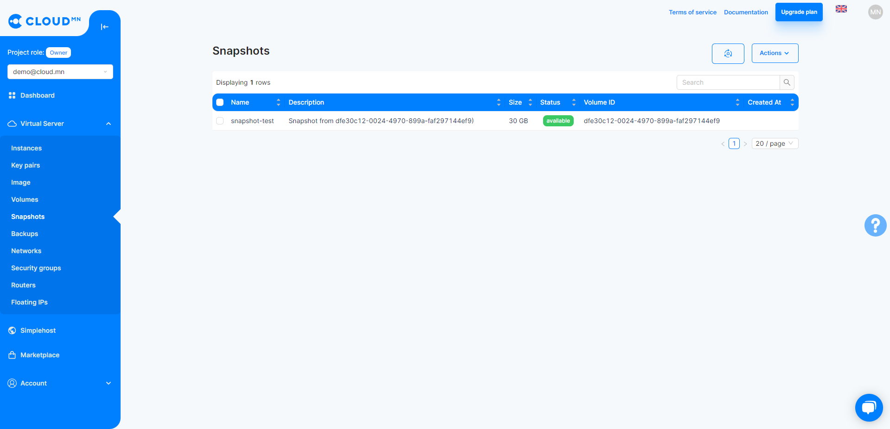
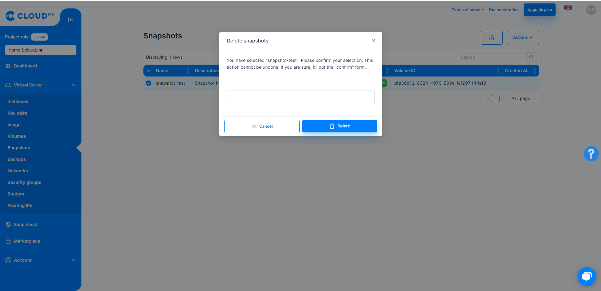
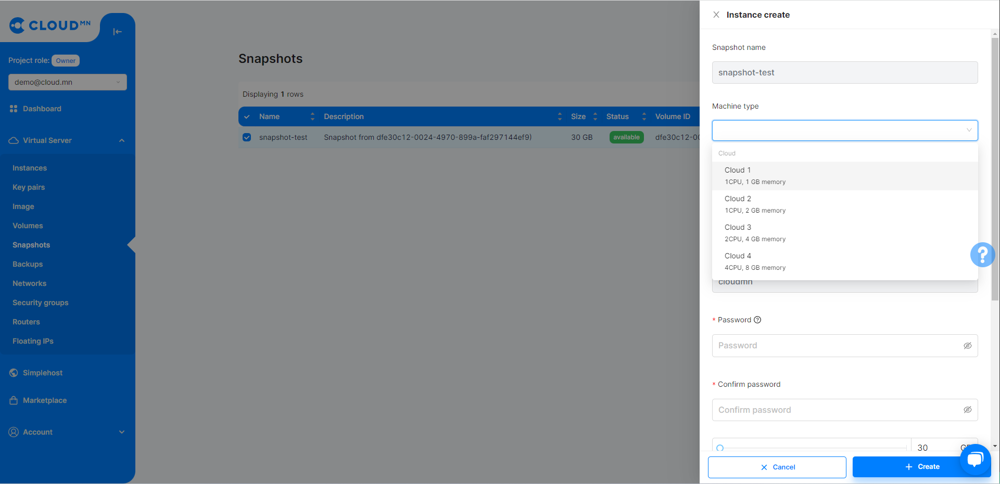

# Snapshots

Snapshot refers to saving changes to the server. Can be used for backup purposes. However, unlike backup, the size of snapshot backup is relatively small and only the changes made to the disk are saved.

## Snapshots actions

### Create a snapshot

:::note Instructions
Creates a Snapshot from the Volume. <a href='./volume#виртуал-дискийн-хуулбарыг-хадгалах-snapshot'>Instructions for creation</a>.
:::

### Delete Snapshot

<ol>
    <li>Click on the 3 dots in the Action column of the snapshot you want to delete, then click the Delete Snapshot button.</li>
</ol>

  

<ol start='2'>
    <li>The following window for deleting Snapshot will open, click the Delete Snapshot button and the deletion will be successful.
</li>
</ol>

  

### Launch Snapshot as an Instance

<ol>
    <li>Enter the Snapshots menu in the Storage menu.</li>
    <li>Select the Snapshot you want to launch and click the Launch as Instance button.</li>
    <li>Click Launch as Instance and a new dialog will appear. and fill in the following fields.</li>
    <ul>
        <li>Server name - Name of the Instance to be created</li>
        <li>Flavor type - Choose the amount to create</li>
        <li>Authentication - Select how to connect to the Instance</li>
        <li>Volume Size - specify the size of the hard disk</li>
    </ul>
    <li>Click the <b>Create</b> button in the lower right corner of the dialog.</li>
</ol>

:::tip Tip
You can view the created Instance by going to the **Instances** menu in the Compute menu...
:::

  

### Will there be a charge for Snapshot?
Users are not charged for manual snapshots, but automatic snapshots are paid for every de-risked day.
