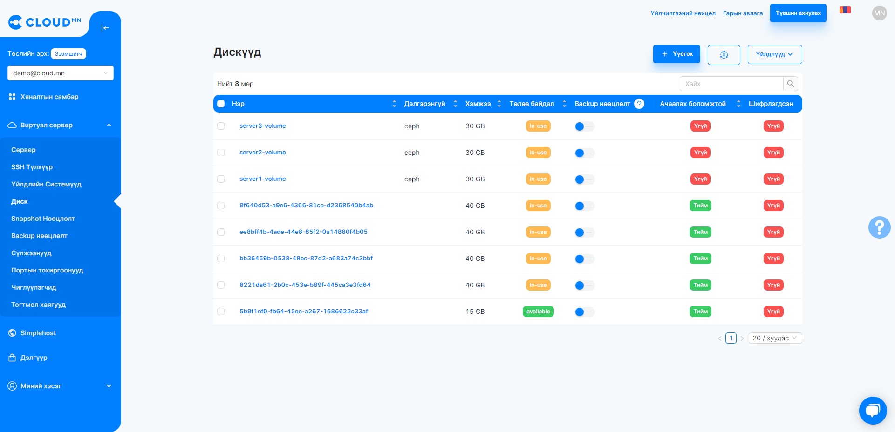
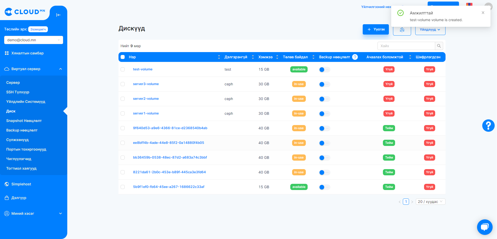
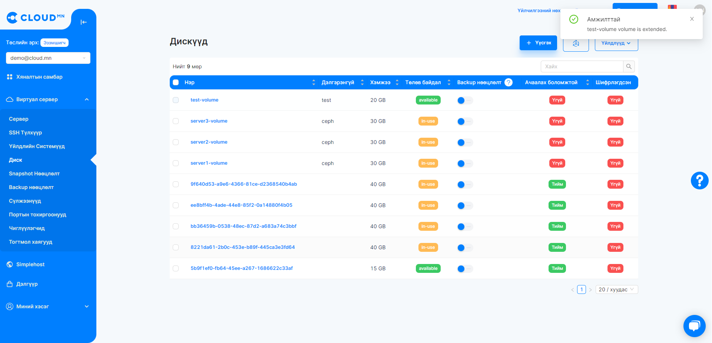
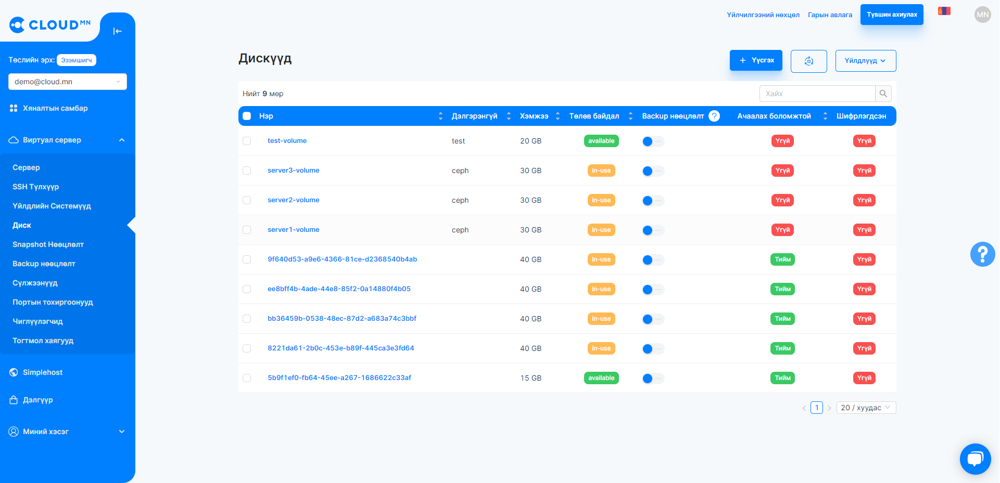
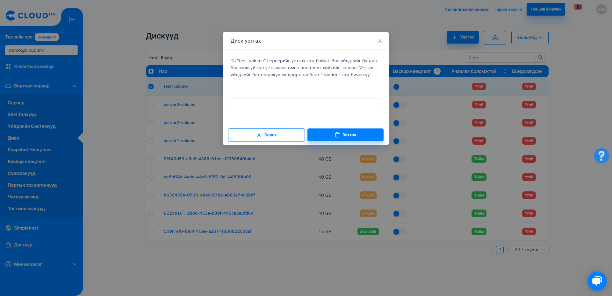

# Disk (Volume)

## Volume menu operations

### Create a virtual disk

<ol>
    <li>When creating a volume or virtual disk, select the <b>Volume</b> menu.</li>
</ol>

  

<ol start='2'>
    <li>When you click the <b>Create Volume</b> button, the following window will open.</li>
</ol>

  

<ol start='3'>
    <li>Fill in the information</li>
</ol>

<ul>
    <li>In the <b>Name</b> field, write the name of the virtual disk.</li>
    <li>In the <b>Type</b> section, select the type of virtual disk.</li>
    <li>In the <b>Size</b> section, select the capacity of the virtual disk, at least 15GB.</li>
    <li>In the <b>Description</b> section, you can write a description of the virtual disk.</li>
</ul>

Complete the following sections and click the **Create** button to begin the virtual disk creation process.

  

After some time, the virtual disk will be successfully created.

  

>Because there is a maximum Volume size allowed by the system for each user, it is not possible to create an excessively large volume. More information <a href="./instance#серверийг-унтраах-shutdown">What to do when creating a large server?</a> from the section.

### Add virtual disk capacity

>If the virtual disk belongs to an Instance, you need to <a href="">shut down</a> the Instance to add capacity.

<ol>
    <li>Select your virtual disk.</li>
</ol>

  

<ol start='2'>
    <li>Click the Resize button and the following window will open. The current size of the virtual disk is displayed and the size cannot be reduced, only increased. Enter the new volume in the New Volume Size field and click the Resize button.</li>
</ol>

  

<ol start='3'>
    <li>After clicking the Resize button, the process of increasing the capacity will begin.</li>
</ol>

  

<ol start='4'>
    <li>When the increased capacity process is completed, the capacity of the virtual disk will be increased successfully</li>
</ol>

  

<ol start='5'>
    <li>Although the size of the virtual disk has increased, when it is imported into the operating system, it is necessary to restart the server and perform additional operations of Disk Management. Note that this is done with different instructions on each operating system.</li>
</ol>

### Delete virtual disk

<ol start='1'>
    <li>When deleting a virtual disk, first click the red button in the Action column of the disk you want to delete, or select the disk and click the Delete Volume button.</li>
</ol>

  

<ol start='2'>
    <li>After pressing the red button, the following window will open, confirm and click the <b>Delete</b> button.</li>
</ol>

  

<ol start='3'>
    <li>After some time, the virtual disk will be deleted.</li>
</ol>

### Save Volume Snapshot (Snapshot)

<ol>
    <li>Enter the Volumes menu in the Storage menu.</li>
    <li>Snapshot Click the <b>Snapshot</b> button in the Action bar of the Volume. This will bring up a new dialog box.</li>
    <li>In the Snapshot <b>Name</b> field, type the name of the Snapshot and click the <b>Save</b> button.</li>
</ol>

  
